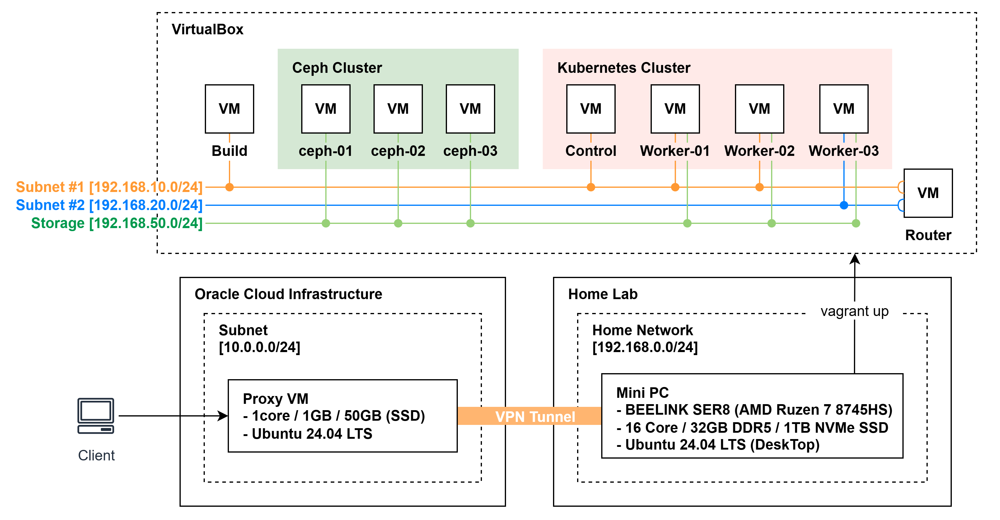
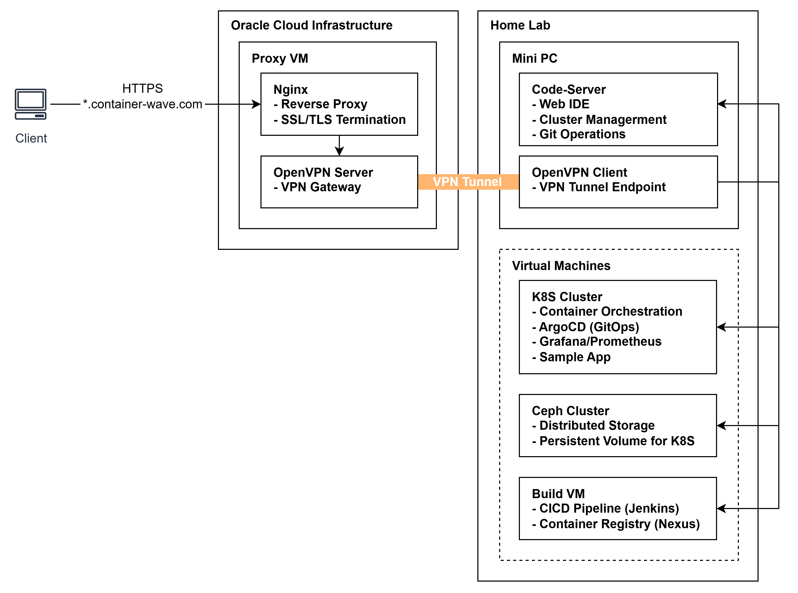

# 01. Infrastructure

단일 Mini PC에 Vagrant + VirtualBox 이용 Cloud Native 환경 구축.
OCI(Oracle Cloud Infrastructure)와 Home Lab 환경을 VPN으로 연동하여 하이브리드 구성.
OCI VM을 Reverse Proxy로 활용해 외부에서 안전하게 Home Lab 환경에 접근할 수 있도록 구성.

## 전체 아키텍처 (Hybrid)




## 리소스 스펙

### 1. Hardware

BEELINK SER8 (베어본) Mini PC 사양 정보

| 구분         | 사양                          | 비고                    |
| ------------ | ----------------------------- | ----------------------- |
| **CPU**      | AMD Ryzen 7 8745HS            | Zen 4, 8C/16T           |
| **Memory**   | Micron Crucial DDR5-5600 32GB | 16GB x 2 (Dual Channel) |
| **Storage**  | NVMe SSD 1TB                  |                         |
| **Graphics** | AMD Radeon 780M (iGPU)        |                         |


### 2. Virtual Machine

OCI VM(Free Tier)와 VirtualBox에 구성된 VM 사양 정보

| 노드       | 역할                      | vCPU   | Memory   | Storage   | OS               |
| ---------- | ------------------------- | ------ | -------- | --------- | ---------------- |
| oracle-vm  | Reverse Proxy             | 1      | 1GB      | 50GB      | Ubuntu 24.04 LTS |
| cilium-ctr | K8s Control Plane         | 2      | 4GB      | 50GB      | Ubuntu 24.04 LTS |
| cilium-w1  | K8s Worker Node           | 2      | 4GB      | 50GB      | Ubuntu 24.04 LTS |
| cilium-w2  | K8s Worker Node           | 2      | 4GB      | 50GB      | Ubuntu 24.04 LTS |
| cilium-w3  | K8s Worker Node           | 2      | 4GB      | 50GB      | Ubuntu 24.04 LTS |
| cilium-r   | Router                    | 1      | 1GB      | 50GB      | Ubuntu 24.04 LTS |
| ceph-01    | Ceph OSD                  | 2      | 4GB      | 100GB     | Ubuntu 24.04 LTS |
| ceph-02    | Ceph OSD                  | 2      | 4GB      | 100GB     | Ubuntu 24.04 LTS |
| ceph-03    | Ceph OSD                  | 2      | 4GB      | 100GB     | Ubuntu 24.04 LTS |
| build      | Private Registry, Jenkins | 1      | 2GB      | 50GB      | Ubuntu 24.04 LTS |
| **합계**   |                           | **16** | **31GB** | **650GB** |                  |

## 상세 설계 및 구현 현황

### 1. Hybrid Architecture (OCI + Home Lab)

#### 1.1 목적

어디서든 접근 가능하면서도 안전한 Home Lab 환경 구축

#### 1.2 배경 및 문제점

가정용 공유기(ipTIME)에서 직접 포트를 오픈할 경우 발생 가능한 보안상 문제점

- **보안 위험**: 홈 네트워크가 인터넷에 직접 노출되어 DDoS, 무차별 대입 공격 등에 취약
- **제한적인 보안 설정**: 가정용 공유기의 방화벽/ACL 기능으로는 세밀한 접근 제어가 어려움
- **HTTPS 적용 불가**: ipTIME 동적 도메인(*.iptime.org)에는 SSL 인증서 발급 및 적용 불가
- **외부 접근 필요성**: 회사, 카페 등 외부에서 홈랩의 IDE, CI/CD, 모니터링 도구에 접근해야 함

#### 1.3 해결 방안

**Oracle Cloud 무료 VM을 Reverse Proxy로 활용한 안전한 외부 접근 환경 구성**

- 가비아에서 구입한 도메인(container-waver.com)을 OCI VM Public IP에 연결
- OpenVPN Client-to-Site 구성으로 홈 네트워크와 OCI VM 간 암호화된 VPN 터널 구축
- Let's Encrypt 인증서를 적용하여 모든 통신 HTTPS 암호화 (+인증서 갱신 자동화 스크립트 적용)
- Oracle Cloud 무료 티어를 활용하여 추가 비용 없이 구축

#### 1.4 외부 접근 플로우 



#### 1.5 구현 상세 관련 블로그 포스트

- [OpenVPN Configuration](./openvpn/README.md)
- [Let's Encrypt 무료 인증서 생성 및 HTTPS 적용](https://engineer-diarybook.tistory.com/entry/Nginx-Lets-Encryption-%EB%AC%B4%EB%A3%8C-%EC%9D%B8%EC%A6%9D%EC%84%9C-%EC%83%9D%EC%84%B1-%EB%B0%8F-HTTPS-%EC%A0%81%EC%9A%A9)


### 2. Service Routing (Nginx Reverse Proxy)

#### 2.1 목적

OCI VM의 Nginx를 통해 외부 요청을 단일 엔드포인트로 Home Lab 서비스 통합

#### 2.2 배경 및 문제점

VPN 터널을 통해 OCI VM과 HomeLab이 연결되었지만, 다수의 내부 서비스에 대한 접근 방식이 필요

- **다수의 서비스 존재**: Code Server, ArgoCD, Jenkins, Nexus, Grafana 등 서로 다른 포트와 IP에 분산
- **포트 기반 접근의 한계**: IP:Port 방식은 직관적이지 않고, 서비스 추가 시마다 포트 관리 복잡도 증가
- **SSL 인증서 관리**: 각 서비스별로 개별 인증서를 적용하면 관리 부담이 크게 증가
- **접근 제어 부재**: 서비스별 통합된 접근 제어 및 로깅 포인트가 없음

#### 2.3 해결 방안

**Nginx Reverse Proxy + 서브도메인 기반 라우팅으로 단일 진입점 구성**

- 서브도메인(vscode.*, cicd.*, mgmt.*, www.*)별로 내부 서비스에 라우팅하여 직관적인 접근 제공
- Let's Encrypt Wildcard 인증서(*.container-wave.com)로 SSL Termination을 Nginx에서 일괄 처리
- VPN 터널(OpenVPN)을 통해 HomeLab 내부 서비스로 트래픽 전달 (외부 직접 노출 없음)
- Nginx 단일 진입점에서 접근 로그 및 보안 설정을 중앙 관리

#### 2.4 Network Flow

```
External Request                    OCI VM (Nginx)                     HomeLab
─────────────────                  ─────────────────                  ─────────────

https://vscode.*:443  ──────────►  SSL Termination  ──────────────►  :8080 (code-server)
https://www.*:443     ──────────►  + Reverse Proxy  ──────────────►  :9000 (Ingress)
https://cicd.*:443    ──────────►       │           ──────────────►  :8443 (ArgoCD)
https://cicd.*:8080   ──────────►       │           ──────────────►  :18080 (Jenkins)
https://cicd.*:8081   ──────────►       │           ──────────────►  :18081 (Nexus)
https://mgmt.*:443    ──────────►       │           ──────────────►  :80 (Grafana)
                                        │
                                   Let's Encrypt
                                   Wildcard Cert
                                   *.container-wave.com
```

| 외부 URL                               | 내부 주소           | 서비스                |
| -------------------------------------- | ------------------- | --------------------- |
| `https://vscode.container-wave.com`    | 192.168.200.2:8080  | Code Server (Web IDE) |
| `https://www.container-wave.com`       | 192.168.200.2:9000  | Sample Application    |
| `https://cicd.container-wave.com`      | 192.168.200.2:8443  | ArgoCD                |
| `https://cicd.container-wave.com:8080` | 192.168.200.2:18080 | Jenkins               |
| `https://cicd.container-wave.com:8081` | 192.168.200.2:18081 | Nexus                 |
| `https://mgmt.container-wave.com`      | 192.168.200.2:80    | Grafana               |


#### 2.5 구현 상세 관련 블로그 포스트

- [Nginx Reverse Proxy 설정](https://engineer-diarybook.tistory.com/entry/Nginx-Reverse-Proxy-%EC%84%A4%EC%A0%95-1)


## 핵심 설계 포인트


### 1. 하이브리드 아키텍처 (On-Premise + Cloud)
- OCI Free Tier를 활용한 외부 접근 게이트웨이
- OpenVPN 터널로 홈 네트워크 직접 노출 없이 안전한 접근
- Let's Encrypt SSL/TLS로 HTTPS 통신 암호화

### 2. Multi-Subnet 네트워크
- 실무 환경과 유사한 네트워크 분리 구현
- Router 노드를 통한 서브넷 간 통신
- Cilium Native Routing 모드 적용

### 3. 스토리지 네트워크 분리
- Public Network (192.168.50.x): 클라이언트 접근
- Cluster Network (192.168.60.x): OSD 간 복제 트래픽

### 4. IaC 기반 자동화
- `vagrant up` 단일 명령으로 전체 환경 구성
- 재현 가능한 인프라 환경

## 외부 서비스 접근

| 서비스      | URL                                  | 용도                |
| ----------- | ------------------------------------ | ------------------- |
| Sample App  | https://www.container-wave.com       | 샘플 애플리케이션   |
| Code Server | https://vscode.container-wave.com    | Web IDE             |
| ArgoCD      | https://cicd.container-wave.com      | GitOps 대시보드     |
| Jenkins     | https://cicd.container-wave.com:8080 | CI 파이프라인       |
| Nexus       | https://cicd.container-wave.com:8081 | Artifact Repository |
| Grafana     | https://mgmt.container-wave.com      | 모니터링 대시보드   |

## 문서 구성

- [hardware-spec.md](./hardware-spec.md) - 하드웨어 사양 및 선정 기준
- [network-topology.md](./network-topology.md) - 네트워크 토폴로지 상세
- [external-access.md](./external-access.md) - 외부 접근 아키텍처 (OCI + VPN)
- [vagrant/README.md](./vagrant/README.md) - Vagrant 프로비저닝 가이드


- [Private Container Image Registry (Nexus) 구축](https://engineer-diarybook.tistory.com/entry/Docker-Container-Image-Registry-%EA%B5%AC%EC%B6%95-Nexus)
