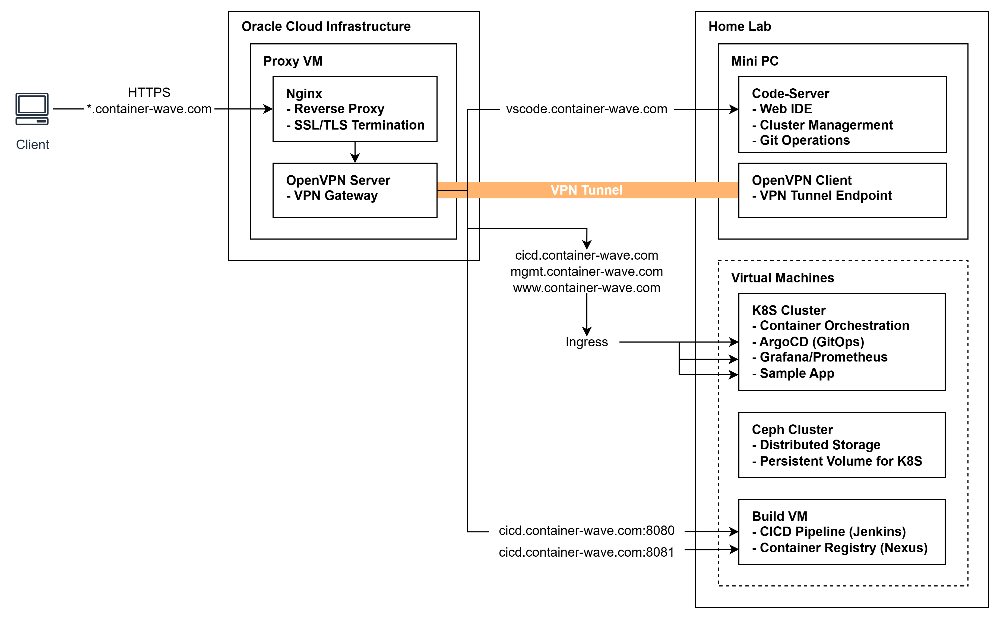

# 01. Infrastructure

단일 Mini PC에 Vagrant + VirtualBox 이용 Cloud Native 환경 구축.
OCI(Oracle Cloud Infrastructure)와 Home Lab 환경을 VPN으로 연동하여 하이브리드 구성.
OCI VM을 Reverse Proxy로 활용해 외부에서 안전하게 Home Lab 환경에 접근할 수 있도록 구성.

## 전체 아키텍처 (Hybrid)


## 리소스 스펙

### 1. Hardware

BEELINK SER8 (베어본) Mini PC 사양 정보

| 구분         | 사양                          | 비고                    |
| ------------ | ----------------------------- | ----------------------- |
| **CPU**      | AMD Ryzen 7 8745HS            | Zen 4, 8C/16T           |
| **Memory**   | Micron Crucial DDR5-5600 32GB | 16GB x 2 (Dual Channel) |
| **Storage**  | NVMe SSD 1TB                  |                         |
| **Graphics** | AMD Radeon 780M (iGPU)        |                         |


### 2. Virtual Machine

OCI VM(Free Tier)와 VirtualBox에 구성된 VM 사양 정보

| 노드       | 역할                      | vCPU   | Memory   | Storage   | OS               |
| ---------- | ------------------------- | ------ | -------- | --------- | ---------------- |
| oracle-vm  | Reverse Proxy             | 1      | 1GB      | 50GB      | Ubuntu 24.04 LTS |
| cilium-ctr | K8s Control Plane         | 2      | 4GB      | 50GB      | Ubuntu 24.04 LTS |
| cilium-w1  | K8s Worker Node           | 2      | 4GB      | 50GB      | Ubuntu 24.04 LTS |
| cilium-w2  | K8s Worker Node           | 2      | 4GB      | 50GB      | Ubuntu 24.04 LTS |
| cilium-w3  | K8s Worker Node           | 2      | 4GB      | 50GB      | Ubuntu 24.04 LTS |
| cilium-r   | Router                    | 1      | 1GB      | 50GB      | Ubuntu 24.04 LTS |
| ceph-01    | Ceph OSD                  | 2      | 4GB      | 100GB     | Ubuntu 24.04 LTS |
| ceph-02    | Ceph OSD                  | 2      | 4GB      | 100GB     | Ubuntu 24.04 LTS |
| ceph-03    | Ceph OSD                  | 2      | 4GB      | 100GB     | Ubuntu 24.04 LTS |
| build      | Private Registry, Jenkins | 1      | 2GB      | 50GB      | Ubuntu 24.04 LTS |
| **합계**   |                           | **16** | **31GB** | **650GB** |                  |

## 서브넷 상세

### Kubernetes 네트워크

| 네트워크     | CIDR            | 용도               | 노드                |
| ------------ | --------------- | ------------------ | ------------------- |
| Subnet1      | 192.168.10.0/24 | K8s Primary        | ctr, w1, w2, router |
| Subnet2      | 192.168.20.0/24 | K8s Secondary      | w3, router          |
| Pod CIDR     | 172.20.0.0/16   | Cilium Pod Network | All K8s nodes       |
| Service CIDR | 10.96.0.0/16    | K8s Service        | All K8s nodes       |

### Ceph Storage 네트워크

| 네트워크 | CIDR            | 용도                    |
| -------- | --------------- | ----------------------- |
| Public   | 192.168.50.0/24 | 클라이언트 → OSD 접근   |
| Cluster  | 192.168.60.0/24 | OSD 간 복제/복구 트래픽 |

### 가상 네트워크 (Router)

| 인터페이스 | IP             | 용도                       |
| ---------- | -------------- | -------------------------- |
| loop1      | 10.10.1.200/24 | Dummy interface (테스트용) |
| loop2      | 10.10.2.200/24 | Dummy interface (테스트용) |

## 라우팅 구성

### Router 노드 (cilium-r)

```bash
# IP Forwarding 활성화
net.ipv4.ip_forward = 1
```

Router 노드는 두 서브넷을 연결하며, 각 서브넷의 노드들은 Router를 통해 통신

### Subnet1 노드 라우팅 테이블

```bash
# net-setting-01.sh 적용 결과
ip route show

192.168.20.0/24 via 192.168.10.200  # Subnet2 → Router 경유
172.20.0.0/16   via 192.168.10.200  # Pod CIDR → Router 경유
10.10.0.0/16    via 192.168.10.200  # Dummy Network → Router 경유
```

### Subnet2 노드 라우팅 테이블

```bash
# net-setting-02.sh 적용 결과
ip route show

192.168.10.0/24 via 192.168.20.200  # Subnet1 → Router 경유
172.20.0.0/16   via 192.168.20.200  # Pod CIDR → Router 경유
10.10.0.0/16    via 192.168.20.200  # Dummy Network → Router 경유
```


## 상세 설계 및 구현 현황

### 1. Hybrid Architecture (OCI + Home Lab)

#### 1.1 목적

어디서든 접근 가능하면서도 안전한 Home Lab 환경 구축

#### 1.2 배경 및 문제점

가정용 공유기(ipTIME)에서 직접 포트를 오픈할 경우 발생 가능한 보안상 문제점

- **보안 위험**: 홈 네트워크가 인터넷에 직접 노출되어 DDoS, 무차별 대입 공격 등에 취약
- **제한적인 보안 설정**: 가정용 공유기의 방화벽/ACL 기능으로는 세밀한 접근 제어가 어려움
- **HTTPS 적용 불가**: ipTIME 동적 도메인(*.iptime.org)에는 SSL 인증서 발급 및 적용 불가
- **외부 접근 필요성**: 회사, 카페 등 외부에서 홈랩의 IDE, CI/CD, 모니터링 도구에 접근해야 함

#### 1.3 해결 방안

**Oracle Cloud 무료 VM을 Reverse Proxy로 활용한 안전한 외부 접근 환경 구성**

- 가비아에서 구입한 도메인(container-wave.com)을 OCI VM Public IP에 연결
- OpenVPN Client-to-Site 구성으로 홈 네트워크와 OCI VM 간 암호화된 VPN 터널 구축
- Let's Encrypt 인증서를 적용하여 모든 통신 HTTPS 암호화 (+[인증서 갱신 자동화 스크립트 적용](./script/certrenew.sh))
- Oracle Cloud 무료 티어를 활용하여 추가 비용 없이 구축

#### 1.4 외부 접근 플로우 


#### 1.5 구현 상세 관련 블로그 포스트

- [OpenVPN Client-to-Site Configuration](./openvpn/README.md)
- [Let's Encrypt 무료 인증서 생성 및 HTTPS 적용](https://engineer-diarybook.tistory.com/entry/Nginx-Lets-Encryption-%EB%AC%B4%EB%A3%8C-%EC%9D%B8%EC%A6%9D%EC%84%9C-%EC%83%9D%EC%84%B1-%EB%B0%8F-HTTPS-%EC%A0%81%EC%9A%A9)


### 2. Service Routing (Nginx Reverse Proxy)

#### 2.1 목적

OCI VM의 Nginx를 통해 외부 요청을 단일 엔드포인트로 Home Lab 내부의 다수 서비스 접근 통합 관리

#### 2.2 해결 방안

**Nginx Reverse Proxy + 서브도메인 기반 라우팅으로 단일 진입점 구성**

- 서브도메인(vscode.*, cicd.*, mgmt.*, www.*)별로 내부 서비스에 라우팅하여 접근
- Let's Encrypt Wildcard 인증서(*.container-wave.com)로 SSL Termination을 Nginx에서 일괄 처리
- 외부의 직접적인 노출 없이 VPN 터널(OpenVPN)을 통해 HomeLab 내부 서비스로 트래픽 전달
- Nginx 단일 진입점에서 접근 로그 및 보안 설정을 중앙 관리

#### 2.3 Network Flow



| 외부 URL                               | 내부 주소           | 서비스                |
| -------------------------------------- | ------------------- | --------------------- |
| `https://vscode.container-wave.com`    | 192.168.200.2:8080  | Code Server (Web IDE) |
| `https://www.container-wave.com`       | 192.168.200.2:9000  | Sample Application    |
| `https://cicd.container-wave.com`      | 192.168.200.2:8443  | ArgoCD                |
| `https://cicd.container-wave.com:8080` | 192.168.200.2:18080 | Jenkins               |
| `https://cicd.container-wave.com:8081` | 192.168.200.2:18081 | Nexus                 |
| `https://mgmt.container-wave.com`      | 192.168.200.2:80    | Grafana               |


#### 2.4 구현 상세 관련 블로그 포스트

- [Nginx Reverse Proxy 설정](https://engineer-diarybook.tistory.com/entry/Nginx-Reverse-Proxy-%EC%84%A4%EC%A0%95-1)


### 3. VM Provisioning Automation (Vagrant + Shell Script)

#### 3.1 목적

`vagrant up` 단일 명령으로 10대 VM 생성부터 K8s 클러스터 구성까지 전체 인프라를 자동 배포

#### 3.2 해결 방안

**Vagrantfile + 역할별 Shell Script로 재현 가능한 인프라 자동 구성**

- Vagrantfile에서 VM 사양, 네트워크, 프로비저닝 스크립트를 선언적으로 정의
- 역할별 Shell Script 분리로 관심사 분리 (init_cfg / cilium-ctr / cilium-w / cilium-r / ceph)
- 버전 정보를 변수화(K8SV, CONTAINERDV, CILIUMV)하여 업그레이드 시 변수만 수정
- Linked Clone 방식으로 Base Image를 공유하여 디스크 사용량 절감

```
vagrant up
  │
  ├─► cilium-ctr ─► init_cfg.sh ─► cilium-ctr.sh ─► net-setting-01.sh
  ├─► cilium-r   ─► cilium-r.sh
  ├─► cilium-w1  ─► init_cfg.sh ─► cilium-w.sh   ─► net-setting-01.sh
  ├─► cilium-w2  ─► init_cfg.sh ─► cilium-w.sh   ─► net-setting-01.sh
  ├─► cilium-w3  ─► init_cfg.sh ─► cilium-w.sh   ─► net-setting-02.sh
  ├─► ceph-01    ─► ceph.sh
  ├─► ceph-02    ─► ceph.sh
  └─► ceph-03    ─► ceph.sh
```

#### 3.3 구현 상세 관련 블로그 포스트

- [Vagrant 프로비저닝 가이드](./vagrant/README.md)