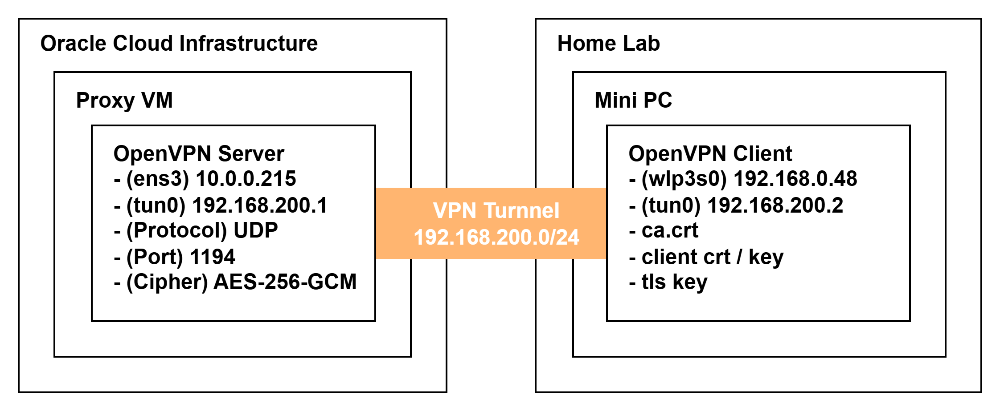

# OpenVPN Configuration

## 네트워크 구성



## 설정 파일 설명

### 파일 구조

```
openvpn/
├── README.md       # 본 문서
├── server.conf     # OCI VM 서버 설정
└── client.conf     # Mini PC 클라이언트 설정
```

### server.conf (OCI VM)

```conf
# 프로토콜 및 포트
port 1194
proto udp
dev tun

# VPN 서브넷 설정
server 192.168.200.0 255.255.255.0
topology subnet

# 암호화
data-ciphers AES-256-GCM:AES-128-GCM:?CHACHA20-POLY1305:AES-256-CBC
tls-auth ta.key 0

# 인증서 경로
ca ca.crt
cert issued/openvpn.container-wave.com.crt
key private/openvpn.container-wave.com.key
dh dh.pem

# 클라이언트 간 통신 허용
client-to-client

# DNS 설정
push "dhcp-option DNS 8.8.8.8"
push "dhcp-option DNS 8.8.4.4"

# 연결 유지
keepalive 10 120

# 로그
log /var/log/openvpn/openvpn.log
status /var/log/openvpn/openvpn-status.log
```

### client.conf (Mini PC)

```conf
client
dev tun
proto udp

# 서버 주소 (OCI Public IP)
remote <OCI_PUBLIC_IP> 1194

# 인증서
ca ca.crt
cert <CLIENT_NAME>.crt
key <CLIENT_NAME>.key
tls-auth ta.key 1

# 옵션
resolv-retry infinite
nobind
persist-key
persist-tun
comp-lzo yes
verb 3
```


## 설치 및 설정

### 1. 서버 설정 (OCI VM)

```bash
# OpenVPN 설치
sudo apt update
sudo apt install openvpn easy-rsa -y

# Easy-RSA 초기화
make-cadir ~/openvpn-ca
cd ~/openvpn-ca

# PKI 초기화 및 인증서 생성
./easyrsa init-pki
./easyrsa build-ca nopass
./easyrsa gen-req server nopass
./easyrsa sign-req server server
./easyrsa gen-dh
openvpn --genkey secret ta.key

# 설정 파일 배포
sudo cp server.conf /etc/openvpn/server/
sudo cp -r pki/* /etc/openvpn/server/

# 서비스 시작
sudo systemctl enable openvpn-server@server
sudo systemctl start openvpn-server@server
```

### 2. 클라이언트 인증서 생성

```bash
# 클라이언트 인증서 생성 (서버에서)
cd ~/openvpn-ca
./easyrsa gen-req client1 nopass
./easyrsa sign-req client client1

# 클라이언트에 전달할 파일
# - ca.crt
# - client1.crt
# - client1.key
# - ta.key
```

### 3. 클라이언트 설정 (Mini PC)

```bash
# OpenVPN 설치
sudo apt install openvpn -y

# 설정 파일 및 인증서 배포
sudo cp client.conf /etc/openvpn/client/
sudo cp ca.crt client1.crt client1.key ta.key /etc/openvpn/client/

# 서비스 시작
sudo systemctl enable openvpn-client@client
sudo systemctl start openvpn-client@client
```

## 방화벽 설정

### OCI Security List

| Direction | Protocol | Port | Source                  |
| --------- | -------- | ---- | ----------------------- |
| Ingress   | UDP      | 1194 | <WiFi_Router_Public_IP> |

### OCI VM (iptables)

```bash
# IP Forwarding 활성화
echo 'net.ipv4.ip_forward=1' | sudo tee -a /etc/sysctl.conf
sudo sysctl -p
```

## 연결 확인

### 서버에서 확인

```bash
# 서비스 상태
sudo systemctl status openvpn-server@server

# 연결된 클라이언트 확인
cat /var/log/openvpn/openvpn-status.log

# tun 인터페이스 확인
ip addr show tun0
```

### 클라이언트에서 확인

```bash
# 서비스 상태
sudo systemctl status openvpn-client@client

# VPN IP 확인
ip addr show tun0

# 서버 연결 테스트
ping 192.168.200.1
```