# Cilium Networking 기초

Cilium CNI의 핵심 구성요소와 네트워킹 동작 원리를 분석한 문서입니다.

## 핵심 포인트 요약

| 주제 | 내용 | 분석 수준 |
|------|------|-----------|
| **Cilium 구성요소** | Operator, Agent, CNI Plugin, Envoy의 역할과 계층 구조 | 아키텍처 분석 |
| **네트워크 인터페이스** | cilium_host, cilium_net, lxc 인터페이스의 동작 원리와 CLI 디버깅 | 실습 검증 |
| **eBPF Packet Flow** | `bpf_lxc.c` 소스코드 추적을 통한 패킷 처리 흐름 분석 (ingress/egress) | eBPF 코드 레벨 분석 |
| **Network Mode** | Encapsulation(VXLAN) vs Native Routing 비교 및 tcpdump 통신 테스트 | 실습 검증 |
| **Masquerading** | 클러스터 외부 통신 시 SNAT 동작 검증, ip-masq-agent 설정 및 트러블슈팅 | 실습 + 트러블슈팅 |
| **IPAM** | Host Scope, Cluster Scope, Multi Pool, LB IPAM 모드별 특성 비교 | 개념 + 실습 |

> 모든 테스트는 홈랩의 Multi-Subnet 환경(Subnet1: 192.168.10.0/24, Subnet2: 192.168.20.0/24)에서 수행되었습니다.

---

**Table of Contents**
---
- [**Table of Contents**](#table-of-contents)
- [Cilium](#cilium)
  - [1. Cilium 구성요소](#1-cilium-구성요소)
    - [1.1 Cilium 구성요소](#11-cilium-구성요소)
    - [1.2 Cilium Agent가 제공하는 디버깅 툴](#12-cilium-agent가-제공하는-디버깅-툴)
  - [2. 네트워크 구성 정보 : _cilium host, cilium net, cilium health_](#2-네트워크-구성-정보--cilium-host-cilium-net-cilium-health)
    - [2.1 네트워크 인터페이스 구조](#21-네트워크-인터페이스-구조)
    - [2.2 Cilium Network Interface 조회](#22-cilium-network-interface-조회)
  - [3. eBPF를 이용한 Packet Flow (eBPF Datapath)](#3-ebpf를-이용한-packet-flow-ebpf-datapath)
    - [3.1 같은 노드에 배치된 Pod 간의 통신 경로](#31-같은-노드에-배치된-pod-간의-통신-경로)
    - [3.2 Pod에서 외부로 나가는 트래픽 통신 경로](#32-pod에서-외부로-나가는-트래픽-통신-경로)
    - [3.3 Pod 내부로 들어오는 트래픽 통신 경로](#33-pod-내부로-들어오는-트래픽-통신-경로)
    - [3.4 Packet Flow 과정에 사용되는 주요 eBPF Program](#34-packet-flow-과정에-사용되는-주요-ebpf-program)
- [Cilium Networking](#cilium-networking)
  - [1. Cluster 내부 통신에 사용되는 Network Mode : _Encapsulation(VxLAN, Geneve), Native/Direct_](#1-cluster-내부-통신에-사용되는-network-mode--encapsulationvxlan-geneve-nativedirect)
    - [1.1 Encapsulation Routing Mode (Default)](#11-encapsulation-routing-mode-default)
    - [1.2 Native Routing Mode](#12-native-routing-mode)
    - [1.3 Native Routing Mode 파드간 통신 테스트](#13-native-routing-mode-파드간-통신-테스트)
  - [2. 클러스터 외부로 향하는 패킷 처리를 위한 Maquerading 처리](#2-클러스터-외부로-향하는-패킷-처리를-위한-maquerading-처리)
    - [2.1 Cluster와 같은 네트워크에 있지만 Cluster에 Join 되지 않은 VM 과의 통신 테스트](#21-cluster와-같은-네트워크에-있지만-cluster에-join-되지-않은-vm-과의-통신-테스트)
    - [2.2 Cluster 외부의 다른 네트워크 대역(10.0.0.0/16)에 있는 네트워크와의 통신 테스트](#22-cluster-외부의-다른-네트워크-대역1000016에-있는-네트워크와의-통신-테스트)
    - [2.3 Cluster 외부의 다른 네트워크 대역(10.0.0.0/16)과 Masquerade 없이 통신하도록 설정하는 방법](#23-cluster-외부의-다른-네트워크-대역1000016과-masquerade-없이-통신하도록-설정하는-방법)
  - [3. 네트워크 엔드포인트(컨테이너/LB) IP 관리를 위한 IPAM (IP Address Management)](#3-네트워크-엔드포인트컨테이너lb-ip-관리를-위한-ipam-ip-address-management)
    - [3.1 Kubernetes Host Scope](#31-kubernetes-host-scope)
    - [3.2 Cluster Scope IPAM (Default)](#32-cluster-scope-ipam-default)
    - [3.3 Multi Pool](#33-multi-pool)
    - [3.4 Load Balaner / Egress IPAM](#34-load-balaner--egress-ipam)

## Cilium

<p align=center>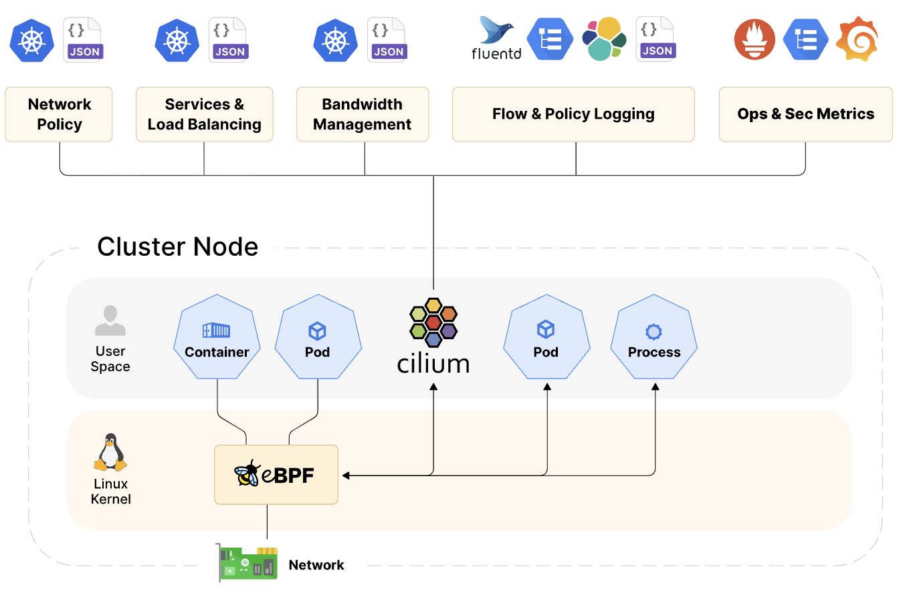</p>

- Cilium은 eBPF 기술을 이용해서 쿠버네티스의 네트워크와 보안 기능을 구현한 쿠버네티스의 CNI Plugin 이다.

- eBPF는 리눅스 커널의 소스코드 변경 없이 커널 내부에서 샌드박스 프로그램을 실행시켜 커널의 기능을 효율적으로 확장시킬 수 있다. [ [BLOG](https://zerotay-blog.vercel.app/4.RESOURCE/KNOWLEDGE/OS/eBPF/) ]

<br>

### 1. Cilium 구성요소

#### 1.1 Cilium 구성요소

<p align=center>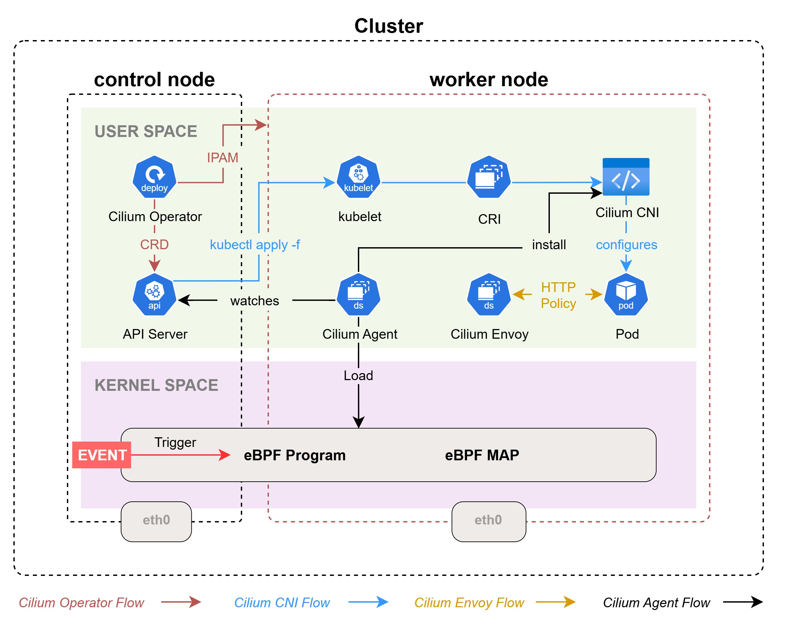</p>

##### Cilium Operator

- Deployment로 배포되어 쿠버네티스 클러스터 수준에서 처리해아 하는 작업(CRD, IPAM 등)을 관리한다.

- Operator는 네트워킹 과정에 깊게 관여하지 않아 일시적인 중단에도 클러스터 동작에 큰 영향을 미치지 않는다.

  - IPAM Pool의 고갈 시 신규 IPAM Pool을 노드에 할당해야 하는데,

  - Operator의 장애로 신규 IPAM Pool 할당이 안될 경우 신규 Pod 생성이 실패한다.

##### Cilium CNI Plug-in (Node Level 작업)

- Pod 생성/삭제/주기적인 상태 확인 시 마다 Container Runtime에 의해 실행되면서 네트워크 구성(가상 인터페이스 구성, IP 할당/해제 등) 작업을 수행한다.

- Operator, Agent, Envoy와 같이 컨테이너로 동작하지 않고 필요할 때만 Container Runtime에 의해 실행된다.

- Binary 파일(`/opt/cni/bin/cilium-cni`, `/etc/cni/net.d/05-cilium.conflist`)로 각 노드에서 관리된다.

##### Cilium Agent (Kernel Level 작업, L3-4 계층)

- 데몬셋(DeamonSet)으로 배포되어 각 노드에서 Pod로 실행된다.

- Cilium Agent는 eBPF Program & MAP 로드, Cilium CNI Plug-in 설치, 쿠버네티스 상태 모니터링을 수행한다.

  - eBPF Program과 eBPF MAP을 커널에 Load 하고 관리한다. 

    - eBPF Program : 커널에서 발생시키는 이벤트(Hook Point)에 의해 실행되며, 네트워킹, 네트워크 정책 시행, 서비스 부하분산 등의 네트워크 기능을 수행한다.

    - eBPF MAP : eBPF Program이 사용하는 커널 내부에 구성되는 데이터 저장소다. User Space에서 MAP에 있는 데이터를 조회할 수도 있다.

  - Cilium CNI Plug-in Binary 파일을 노드에 설치하여 전반적인 네트워크 구성의 기능을 제공한다.

  - API Server와 통신하면서 쿠버네티스 리소스의 상태를 모니터링한다. 변경 사항이 발생하면 eBPF MAP을 업데이트 한다.

##### Envoy Proxy (UserSpace 작업, L7 계층)

- 데몬셋(DeamonSet)으로 배포되어 각 노드에서 Pod로 실행된다.

- Cilium L7 계층 관련 기능(Ingress, Gateway API, L7 Network Policies 등)을 사용하는 경우, Envoy Proxy를 통해 라우팅된다.

- HTTP 트래픽 제어, L7 Network Policy 시행, 정교한 라우팅 정책 관리와 같은 L7 기반 동적 라우팅/보안 기능을 제공한다.

> [!TIP]
> - Cilium에서 L3~4 계층의 트래픽은 Kernel의 eBPF Program으로 관리하고, L7 계층의 트래픽 처리는 Envoy에 위임는 구조로 동작한다.
> - 이러한 구조로 인해 MetalLB의 지원 없이 직접 LB, Ingress의 External IP 할당을 관리할 수 있다.
> - Envoy는 Ingress 라우팅 규칙 관리, L7 계층 Network Policy 등을 구현하고, Ingress의 External IP에 대한 L2 announcement, BGP 처리는 eBPF에서 처리한다.

<br>

#### 1.2 Cilium Agent가 제공하는 디버깅 툴

- Cilium Agent에는 관리용 CLI 두 가지(`cilium-dbg`, `bpftool`)를 제공한다.

  - cilium-dbg : Cilium 구성과 관련된 일반 적인 상태 정보, 정책, 서비스 목록 등을 확인하는데 사용한다.

  - bpftool : eBPF 수준의 디버깅이 필요한 경우 사용되는 도구로 커널에 로드된 eBPF 프로그램 목록, MAP 목록 조회 등에 사용한다.

- Cilium Agent Pod 내에서 실행할 수 있지만 `kubectl` 명령을 사용할 수 있는 노드(Control)에서 각 노드의 Cilium Agent를 통해 툴을 사용하도록 단축키를 지정한다.

  ```bash
  # /ect/profile
  export CILIUMPOD0=$(kubectl get -l k8s-app=cilium pods -n kube-system --field-selector spec.nodeName=cilium-ctr -o jsonpath='{.items[0].metadata.name}')
  export CILIUMPOD1=$(kubectl get -l k8s-app=cilium pods -n kube-system --field-selector spec.nodeName=cilium-w1 -o jsonpath='{.items[0].metadata.name}')
  export CILIUMPOD2=$(kubectl get -l k8s-app=cilium pods -n kube-system --field-selector spec.nodeName=cilium-w2 -o jsonpath='{.items[0].metadata.name}')
  alias c0="kubectl exec -it $CILIUMPOD0 -n kube-system -c cilium-agent -- cilium"
  alias c1="kubectl exec -it $CILIUMPOD1 -n kube-system -c cilium-agent -- cilium"
  alias c2="kubectl exec -it $CILIUMPOD2 -n kube-system -c cilium-agent -- cilium"
  alias c0bpf="kubectl exec -it $CILIUMPOD0 -n kube-system -c cilium-agent -- bpftool"
  alias c1bpf="kubectl exec -it $CILIUMPOD1 -n kube-system -c cilium-agent -- bpftool"
  alias c2bpf="kubectl exec -it $CILIUMPOD2 -n kube-system -c cilium-agent -- bpftool"
  ```

  ```bash
  source /etc/profile
  ```

<br>

### 2. 네트워크 구성 정보 : _<span style="font-size: smaller; color: Aquamarine;">cilium host, cilium net, cilium health</span>_

#### 2.1 네트워크 인터페이스 구조

<p align=center>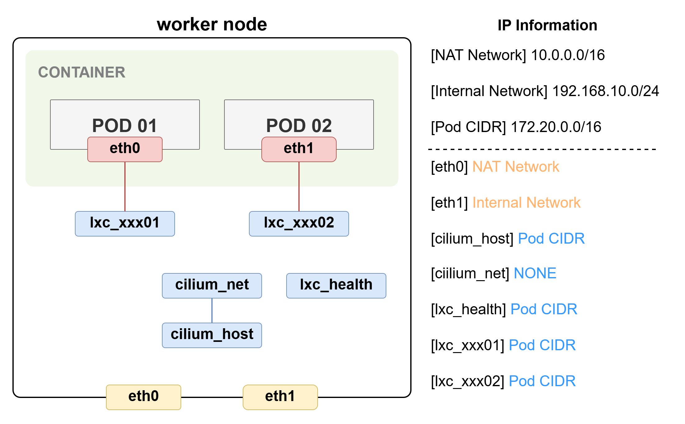</p>

##### cilium_host

- Cilium이 관리하는 호스트 네트워크 인터페이스다.

- Pod와 호스트 간의 통신, Pod와 Cluster 외부 네트워크 간의 연결에 사용된다. (Pod CIDR 대역 IP가 할당된다.)

- 외부에서 들어오는 패킷을 Pod로 전달하는 Reverse NAT 기능을 포함한다.

##### cilium_net

- cilium_host와 연결되는 veth pair 인터페이스다. (IP가 할당되지 않는다.)

- Cluster 내부에 배포된 Pod 간의 통신(보안 정책 적용, 패킷 필터링, 네트워크 성능 측정 등)을 처리한다.

##### cilium_health (lxc_health)

- Cilium Agent가 Cluster의 상태와 Container와의 통신 가능 여부를 확인하기 위해 사용하는 인터페이스다.

- PodCIDR 대역의 IP를 할당 받아서 사용하는데, 쿠버네티스에 의해 Pod로 생성된 리소스가 아니고 Cilium Agent에 의해 만들어지는 veth 인터페이스라서 kubectl로 정보를 조회할 수 없다.

##### lxcxxxx

- Pod에 할당되는 eth 인터페이스와 맵핑되는 가상 인터페이스다.

- 호스트 노드에서 IP 값은 조회되지 않지만 실제로는 Pod가 사용할 PodCIDR 대역의 IP가 할당되어 있다.

<br>

#### 2.2 Cilium Network Interface 조회

- control 노드에서 인터페이스의 목록을 확인해보면 cilium net, cilium host, lxc_health, lxcxxxxx 등의 인터페이스를 볼 수 있다.

  ```bash
  $ ip -c -br addr show
  lo                      UNKNOWN        127.0.0.1/8 ::1/128 
  eth0                    UP             10.0.2.15/24 metric 100 fd17:625c:f037:2:a00:27ff:fe6b:69c9/64 fe80::a00:27ff:fe6b:69c9/64 
  eth1                    UP             192.168.10.100/24 fe80::a00:27ff:fe30:52ea/64 
  cilium_net@cilium_host  UP             fe80::c82f:a2ff:fe04:7075/64 
  cilium_host@cilium_net  UP             172.20.2.28/32 fe80::30a8:dcff:fe03:da79/64 
  lxc_health@if6          UP             fe80::b0f3:9dff:fe38:f6f8/64 
  lxc72aa2e79d206@if8     UP             fe80::343b:39ff:fe72:d95d/64 
  ```

  - control 노드에서는 `lxc_health`, `lxc72aa2e79d206@if8` 인터페이스의 IP 정보는 직접 확인할 수 없다.

  - Interface에 할당된 상세 정보를 조회할 때는 cilium 에서 제공하는 cli(ciliu-dbg)를 이용해 조회할 수 있다.

- Interface 정보 상세 조회

  - cilium cli를 이용해서 control 노드에 할당되어 있는 IP 정보를 검색하면 다음과 같이 3개를 사용하고 있다는 것을 확인할 수 있다.

    ```bash
    $ c0 status --verbose | grep -A3 "Allocated"
    Allocated addresses:
    172.20.2.28 (router)
    172.20.2.5 (health)
    172.20.2.97 (default/curl-pod)
    ```

    - `router`와 `health`는 노드마다 Default로 생성되는 IP 정보다. 그 이외의 IP는 Pod의 수 만큼 추가로 할당된다.

    - Pod가 많지 않을 때는 이름을 보고 health 또는 파드의 Interface를 추정해볼 수 있지만 많을 경우 제한된다.

  - 먼저 `health` 인터페이스의 IP가 실제 control 노드에서 봤던 `lxc_health@if6` 인터페이스와 맵핑된 정보인지 확인하는 방법은 `ENDPOINT_ID` 조회 → `ENDPOINT`의 세부정보 조회를 통해 확인할 수 있다.

  - cilium에서는 각 endpoint(interface or ip address) 마다 `ENDPOINT_ID`를 할당하는데 해당 정보를 cilium cli로 조회한다.

    ```bash
    $ c0 endpoint list | grep 172.20.2.5
    ENDPOINT   POLICY (ingress)   POLICY (egress)   IDENTITY   LABELS (source:key[=value])                                                  IPv6   IPv4          STATUS   
               ENFORCEMENT        ENFORCEMENT 
    8          Disabled           Disabled          4          reserved:health                                                                     172.20.2.5    ready
    ```

  - `172.20.2.5(health)` IP에 할당 된 `ENDPOINT_ID`를 이용해서 해당 `ENDPOINT`의 세부 정보를 조회하면 control 노드에서 보았던 Interface Name, MAC 주소를 확인할 수 있다.

    ```bash
    $ c0 endpoint get 8 | grep -A11 networking
    "networking": {
      "addressing": [
        {
          "ipv4": "172.20.2.5",
          "ipv4-pool-name": "default"
        }
      ],
      "host-mac": "b2:f3:9d:38:f6:f8",
      "interface-index": 7,
      "interface-name": "lxc_health",
      "mac": "de:a9:ab:a9:a4:b4"
    },
    ```

    ```bash
    $ ip -c addr show lxc_health
    7: lxc_health@if6: <BROADCAST,MULTICAST,UP,LOWER_UP> mtu 1500 qdisc noqueue state UP group default qlen 1000
        link/ether b2:f3:9d:38:f6:f8 brd ff:ff:ff:ff:ff:ff link-netnsid 0
        inet6 fe80::b0f3:9dff:fe38:f6f8/64 scope link 
          valid_lft forever preferred_lft forever
    ```

  - 같은 방법으로 Pod와 연결된 `lxc72aa2e79d206@if8` 인터페이스의 정보를 상세 조회하면 control 노드에 배포된 `curl-pod`의 Interface Name, IP, MAC 주소를 확인할 수 있다.

    - control 노드에서 사용중인 IP 정보 조회

      ```bash
      $ c0 status --verbose | grep -A3 "Allocated"
      Allocated addresses:
      172.20.2.28 (router)
      172.20.2.5 (health)
      172.20.2.97 (default/curl-pod)
      ```

    - `curl-pod`의 IP로 `ENDPOINT_ID` 조회

      ```bash
      $ c0 endpoint list | grep 172.20.2.97
      ENDPOINT   POLICY (ingress)   POLICY (egress)   IDENTITY   LABELS (source:key[=value])                                                  IPv6   IPv4          STATUS   
                 ENFORCEMENT        ENFORCEMENT 
      190        Disabled           Disabled          47080      k8s:app=curl                                                                        172.20.2.97   ready
      ```

    - `172.20.2.97` IP에 할당 된 `ENDPOINT_ID`를 이용해서 해당 `ENDPOINT`의 세부 정보를 조회

      ```bash
      $ c0 endpoint get 190 | grep -A12 networking
      "networking": {
        "addressing": [
          {
            "ipv4": "172.20.2.97",
            "ipv4-pool-name": "default"
          }
        ],
        "container-interface-name": "eth0",
        "host-mac": "36:3b:39:72:d9:5d",
        "interface-index": 9,
        "interface-name": "lxc72aa2e79d206",
        "mac": "86:20:27:47:66:28"
      },
      ```

- Pod에서 Router로 사용하고 있는 IP의 정보 조회

  - cilium cli을 통해 control 노드에 할당되어 있는 IP의 정보를 검색하면 `router` 항목을 확인할 수 있다.

    ```bash
    $ c0 status --verbose | grep -A3 "Allocated"
    Allocated addresses:
    172.20.2.28 (router)
    172.20.2.5 (health)
    172.20.2.97 (default/curl-pod)
    ```

  - 이 인터페이스는 control 노드에 할당된 `cilium_host` 인터페이스의 IP와 같은 값이 할당되어 있다.

    ```bash
    $ ip -c -br addr show | grep cilium_host
    cilium_host@cilium_net UP             172.20.2.28/32 fe80::30a8:dcff:fe03:da79/64
    ```

  - `ENDPOINT_ID` 값을 이용해서 `ENDPOINT`의 세부 정보를 조회해도 실제 인터페이스에 할당된 이름이 `cilium_host`임을 확인할 수 있다.

    - router의 세부 정보 조회 시 `cilium_host`의 IP가 같이 표기되지 않기 때문에 `reserved:host` LABELS이 할당된 항목의 `ENDPOINT_ID`를 사용해야 한다.

      ```bash
      $ c0 endpoint list
      ...
      ENDPOINT   POLICY (ingress)   POLICY (egress)   IDENTITY   LABELS (source:key[=value])                                              IPv6   IPv4          STATUS   
                ENFORCEMENT        ENFORCEMENT                                                                                                                
      240        Disabled           Disabled          1          k8s:node-role.kubernetes.io/control-plane                                                     ready   
                                                                 k8s:node.kubernetes.io/exclude-from-external-load-balancers                                           
                                                                 reserved:host     
      ```

    - `ENDPOINT` 세부 정보 조회

      ```bash
      $ c0 endpoint get 240 | grep -A6 networking
      "networking": {
        "addressing": [
          {}
        ],
        "host-mac": "32:a8:dc:03:da:79",
        "interface-name": "cilium_host",
        "mac": "32:a8:dc:03:da:79"
      },
      ```

  - 그리고 실제로 이 IP는 control 노드에 배포된 Pod의 routing 정보를 조회 했을 때 default gateway로 사용되고 있는 것을 확인할 수 있다.

    ```bash
    $ kubectl exec -it curl-pod -- ip -c route 
    default via 172.20.2.28 dev eth0 mtu 1500 
    172.20.2.28 dev eth0 scope link 
    ```

<br>

### 3. eBPF를 이용한 Packet Flow (eBPF Datapath)

- `L7 Network Policy`, `Encryption`, `Network Mode` 설정이 적용된 경우 점선으로 표시된 항목들까지 통신 경로에 추가 된다.

- 별도로 활성화한 기능이나 정책이 없을 경우 Pod의 `lxc` 인터페이스에서 패킷이 출발하는 순간 커널의 TCX(Traffic Control eXpress) Hook을 통해 eBPF 프로그램(`bpf_lxc`, `bpf_host`)이 트리거 된다.

- 이 때 네트워크 트래픽은 커널 내부의 eBPF 프로그램에 의해서 정책이 평가되고, 평가 결과에 따라서 Flow가 결정된다.

#### 3.1 같은 노드에 배치된 Pod 간의 통신 경로

<p align=center></p>

<br>

#### 3.2 Pod에서 외부로 나가는 트래픽 통신 경로

<p align=center></p>

<br>

#### 3.3 Pod 내부로 들어오는 트래픽 통신 경로

<p align=center></p>

<br>

#### 3.4 Packet Flow 과정에 사용되는 주요 eBPF Program

##### 3.4.1 Pod Interface에 할당되는 eBPF Program 조회

- 실행되는 eBPF 프로그램(Component)명은 노란색 박스에 표시되는데, 이 프로그램들은 `cilium-agent` 내부에 C언어 파일로 `/var/lib/cilium/bpf` 폴더에 존재한다.
  
- 이 코드에 대한 내용은 Cilium GitHub 문서에서도 확인할 수 있다. [ [LINK](https://github.com/cilium/cilium/tree/main/bpf) ]

  ```bash
  # /var/lib/cilium/bpf
  $ ls -al
  total 336
  drwxr-xr-x 1 root root  4096 Jul 16 10:05 .
  drwxr-x--- 1 root root  4096 Jul 28 14:05 ..
  -rw-r--r-- 1 root root   420 Jul 16 10:05 COPYING
  -rw-r--r-- 1 root root  1296 Jul 16 10:05 LICENSE.BSD-2-Clause
  -rw-r--r-- 1 root root 18012 Jul 16 10:05 LICENSE.GPL-2.0
  -rw-r--r-- 1 root root 20261 Jul 16 10:05 Makefile
  -rw-r--r-- 1 root root  3533 Jul 16 10:05 Makefile.bpf
  -rw-r--r-- 1 root root  2945 Jul 16 10:05 bpf_alignchecker.c
  -rw-r--r-- 1 root root 58666 Jul 16 10:05 bpf_host.c
  -rw-r--r-- 1 root root 76153 Jul 16 10:05 bpf_lxc.c       # lxcxxx interface를 지날 때 트리거 되는 eBPF 프로그램
  -rw-r--r-- 1 root root  2797 Jul 16 10:05 bpf_network.c
  -rw-r--r-- 1 root root 25289 Jul 16 10:05 bpf_overlay.c
  -rw-r--r-- 1 root root 31334 Jul 16 10:05 bpf_sock.c
  -rw-r--r-- 1 root root  1424 Jul 16 10:05 bpf_wireguard.c
  -rw-r--r-- 1 root root  9064 Jul 16 10:05 bpf_xdp.c
  drwxr-xr-x 6 root root  4096 Jul 16 10:05 complexity-tests
  drwxr-xr-x 2 root root  4096 Jul 16 10:05 custom
  -rw-r--r-- 1 root root  1870 Jul 16 10:05 ep_config.h
  -rw-r--r-- 1 root root   517 Jul 16 10:05 filter_config.h
  drwxr-xr-x 1 root root  4096 Jul 16 10:05 include
  drwxr-xr-x 2 root root  4096 Jul 16 10:05 lib
  -rw-r--r-- 1 root root   404 Jul 16 10:05 netdev_config.h
  -rw-r--r-- 1 root root 10753 Jul 16 10:05 node_config.h
  drwxr-xr-x 4 root root  4096 Jul 16 10:05 tests
  ```

- Pod의 인터페이스 마다 할당되는 eBPF 프로그램의 함수는 `Pod Interface 정보 조회` → `할당된 eBPF Program ID 조회` → `프로그램 내 함수명 조회` 순으로 확인할 수 있다.

  - Pod Interface 정보 조회

    - Pod 조회

      ```bash
      $ kubectl get po -owide
      NAME                      READY   STATUS    RESTARTS        AGE   IP             NODE         NOMINATED NODE   READINESS GATES
      curl-pod                  1/1     Running   1 (4h34m ago)   14h   172.20.2.244   cilium-ctr   <none>           <none>
      webpod-697b545f57-5fmfp   1/1     Running   0               14h   172.20.0.97    cilium-w1    <none>           <none>
      webpod-697b545f57-g9c5f   1/1     Running   0               14h   172.20.1.38    cilium-w2    <none>           <none>
      ```

    - Pod의 ENDPOINT 정보 조회

      ```bash
      $ c0 endpoint list | grep 172.20.2.244
      ENDPOINT   POLICY (ingress)   POLICY (egress)   IDENTITY   LABELS (source:key[=value])        IPv6   IPv4           STATUS   
                ENFORCEMENT        ENFORCEMENT
      4          Disabled           Disabled          47080      k8s:app=curl                              172.20.2.244   ready
      ```

    - Pod의 Interface Name 조회

      ```bash
      $ c0 endpoint get 4 | grep -A11 networking
            "networking": {
              "addressing": [
                {
                  "ipv4": "172.20.2.244",
                  "ipv4-pool-name": "default"
                }
              ],
              "container-interface-name": "eth0",
              "host-mac": "12:73:95:0d:4e:56",
              "interface-index": 9,
              "interface-name": "lxc49adfa975abf",
              "mac": "4e:22:88:88:7d:20"
      ```

  - Pod의 Interface에 적용된 eBPF 프로그램을 조회하면 `cil_from_container`, `cil_to_container` 함수 이름을 확인할 수 있다.

    ```bash
    $ c0bpf net show | grep lxc49adfa975abf
    lxc49adfa975abf(9) tcx/ingress cil_from_container prog_id 1143 link_id 23 
    lxc49adfa975abf(9) tcx/egress cil_to_container prog_id 1149 link_id 24
    ```

    - `cil_from_container` : Pod에서 나가는 트래픽(egress)에 대한 정책을 평가하고 적용한다.

    - `cil_to_container` : Pod로 들어오는 트래픽(ingress)에 대한 정책을 평가하고 적용한다.

##### 3.4.2 Pod로 들어오는 트래픽에 사용되는 eBPF Program 확인

- Cilium Agent 접속 후 `/var/lib/cilium/bpf/bpf_lxc.c` 파일을 grep으로 `cil_to_container()` 함수를 조회하면 세부 내용을 확인할 수 있다.

  ```bash
  $ grep -n -A160 "cil_to_container" /var/lib/cilium/bpf/bpf_lxc.c
  2335:int cil_to_container(struct __ctx_buff *ctx)
  2336-{
  ...
  2450-
  2451-BPF_LICENSE("Dual BSD/GPL");
  ```

- `cil_to_container()` 함수 내부 코드는 네트워크 정책 평가를 진행한 후 모두 통과 시 컨테이너로 트래픽을 Redirecting 한다.

  - L7 트래픽을 처리해야 할 경우에는 `tail_call_egress_policy()` 함수를 통해 네트워크 정책이 적용된다. 

    ```c
    #if defined(ENABLE_L7_LB)
      ...
        ret = tail_call_egress_policy(ctx, lxc_id);
        return send_drop_notify(ctx, lxc_id, sec_label, LXC_ID,
              ret, METRIC_INGRESS);
      }
    #endif
    ```

  - 호스트 방화벽 정책 적용이 필요한 경우 `tail_call_policy()` 함수를 통해 정책이 적용된다.

    ```c
    #if defined(ENABLE_HOST_FIREWALL) && !defined(ENABLE_ROUTING)
      if (identity == HOST_ID) {
        ...
        ret = tail_call_policy(ctx, CONFIG(host_ep_id));
        return send_drop_notify(ctx, identity, sec_label, LXC_ID,
              DROP_HOST_NOT_READY, METRIC_INGRESS);
      }
    #endif /* ENABLE_HOST_FIREWALL && !ENABLE_ROUTING */
    ```

  - 그 다음 프로토콜의 종류에 따라서 다르게 처리하기 위한 switch문이 있다.

    ```c
    	switch (proto) {
    #if defined(ENABLE_ARP_PASSTHROUGH) || defined(ENABLE_ARP_RESPONDER)
      case bpf_htons(ETH_P_ARP):
        ret = CTX_ACT_OK;
        break;
    #endif
    #ifdef ENABLE_IPV6
      case bpf_htons(ETH_P_IPV6):
        sec_label = SECLABEL_IPV6;
        ctx_store_meta(ctx, CB_SRC_LABEL, identity);
        ret = tail_call_internal(ctx, CILIUM_CALL_IPV6_CT_INGRESS, &ext_err);
        break;
    #endif /* ENABLE_IPV6 */
    #ifdef ENABLE_IPV4
      case bpf_htons(ETH_P_IP):
        sec_label = SECLABEL_IPV4;
        ctx_store_meta(ctx, CB_SRC_LABEL, identity);
        ret = tail_call_internal(ctx, CILIUM_CALL_IPV4_CT_INGRESS, &ext_err);
        break;
    #endif /* ENABLE_IPV4 */
      default:
        ret = DROP_UNKNOWN_L3;
        break;
      }
    ```

  - 여기에서 마지막으로 `tail_call_internal()` 함수가 다음 작업 처리를 이어서 처리할 함수로 점프한다.

  - eBPF에서 `tail_call()` 함수는 eBPF Program이 다른 eBPF Program을 호출해서 작업을 이어서 진행할 때 사용한다. [ [BLOG](https://www.ebpf.top/en/post/bpf2pbpf_tail_call/#6-summary) ]

    - cilium에서 사용되는 `tail_call()`은 `/var/lib/cilium/bpf/lib/tailcall.h`, `/var/lib/cilium/bpf/include/bpf/tailcall.h` 파일에서 `tail_call_static()` 함수로 정의 되어 있다.

    - 파라미터로 ctx_ptr(packet context pointer), BPF Program이 담긴 Array 유형의 MAP, 호출할 eBPF Program의 Index 값을 가지고 호출한다.

  - `tail_call_internal()` 함수 이후에는 커널 내부의 레지스트리 값, cilium이 유지하는 Program Index 값의 정보 확인이 제한되어 호출되는 함수를 확인하기 어렵다.

  - 그대신 최종적으로 Pod로 트래픽이 들어오게 되는 결정적인 역할을 하는 eBPF 프로그램은 cilium cli를 통한 트래픽 모니터링, hubble(cilium이 제공하는 관측툴)을 이용해 tracemessage를 이용해 어떤 프로그램이 사용되었는지 추정해볼 수 있다.

    - cilium cli 이용 ICMP 트래픽 모니터링 결과 : tracemessage = `to-endpoint`

      ```bash
      # curl-pod to netshoot-pod ping test
      $ c0 monitor --related-to=1169 -vv
      Listening for events on 2 CPUs with 64x4096 of shared memory
      Press Ctrl-C to quit
      ------------------------------------------------------------------------------
      time="2025-08-06T06:23:02.588511331Z" level=info msg="Initializing dissection cache..." subsys=monitor
      Ethernet        {Contents=[..14..] Payload=[..86..] SrcMAC=a2:cc:fe:3f:b5:99 DstMAC=0e:98:9e:22:60:65 EthernetType=IPv4 Length=0}
      IPv4    {Contents=[..20..] Payload=[..64..] Version=4 IHL=5 TOS=0 Length=84 Id=36008 Flags=DF FragOffset=0 TTL=63 Protocol=ICMPv4 Checksum=20958 SrcIP=172.20.2.179 DstIP=172.20.2.71 Options=[] Padding=[]}
      ICMPv4  {Contents=[..8..] Payload=[..56..] TypeCode=EchoRequest Checksum=65441 Id=54 Seq=1}
      CPU 01: MARK 0x0 FROM 1234 to-endpoint: 98 bytes (98 captured), state new, interface lxc6bfc4c764fad, , identity 47080->47080, orig-ip 172.20.2.179, to endpoint 1234
      ```

    - hubble 트래픽 관측 결과 : tracemessage = `to-endpoint`

      ```bash
      # curl-pod to netshoot-pod ping test
      $ hubble observe -f --protocol icmp
      ...
      Aug  6 06:50:26.228: default/curl-pod (ID:47080) -> default/netshoot-pod (ID:47080) to-endpoint FORWARDED (ICMPv4 EchoRequest)
      Aug  6 06:50:26.228: default/curl-pod (ID:47080) <- default/netshoot-pod (ID:47080) to-endpoint FORWARDED (ICMPv4 EchoReply)
      ```

    - `cilium/pgk/monitor/api/types.go` 파일의 `TraceObservationPoints` 변수를 확인하면 `TraceToLxc` 키를 사용할 경우 `to-endpoint` 메세지가 출력되는 것을 알 수 있다.

      ```go
      var TraceObservationPoints = map[uint8]string{
        TraceToLxc:       "to-endpoint",
        TraceToProxy:     "to-proxy",
        TraceToHost:      "to-host",
        TraceToStack:     "to-stack",
        TraceToOverlay:   "to-overlay",
        TraceToNetwork:   "to-network",
        TraceToCrypto:    "to-crypto",
        TraceFromLxc:     "from-endpoint",
        TraceFromProxy:   "from-proxy",
        TraceFromHost:    "from-host",
        TraceFromStack:   "from-stack",
        TraceFromOverlay: "from-overlay",
        TraceFromNetwork: "from-network",
        TraceFromCrypto:  "from-crypto",
      }
      ```

    - 다시 `bpf_lxc.c` 파일내부에서 `TRACE_TO_LXC` 유형으로 키워드를 검색하게 되면 `send_trace_notify6()`, `send_trace_notify4()` 함수에서 사용되고 있는 것을 알 수 있다.

    - IPv4를 사용하고 있기 때문에 `send_trace_notify4()` 함수의 코드가 포함된 `ipv4_policy()` 프로그램을 살펴보면 최종적으로 이 곳에서 패킷이 Pod에 전달되는 것을 확인할 수 있다.

      - proxy를 거치는 L7 트래픽인 경우 Envoy로 redirect 되도록 `POLICY_ACT_PROXY_REDIRECT` 값을 리턴하고

        ```c
        if (*proxy_port > 0)
          goto redirect_to_proxy;
        ...
        redirect_to_proxy:
        send_trace_notify4(ctx, TRACE_TO_PROXY, src_label, SECLABEL_IPV4, orig_sip,
              bpf_ntohs(*proxy_port), ifindex, trace.reason,
              trace.monitor);
        if (tuple_out)
          *tuple_out = *tuple;
        return POLICY_ACT_PROXY_REDIRECT;
        ```

      - 그렇지 않고, 바로 처리되는 경우 `send_trace_notify4()` 함수로 tracemessgae를 생성한 다음 `CTX_ACT_OK` 값을 리턴한다. 

        ```c
        send_trace_notify4(ctx, TRACE_TO_LXC, src_label, SECLABEL_IPV4, orig_sip, LXC_ID, ifindex, trace.reason, trace.monitor);

        return CTX_ACT_OK;
        ```

      - 리턴된 값은 `tail_ipv4_to_endpoint()` 함수에서 switch를 통해 envoy를 통해 처리되거나 직접 파드로 전달하도록 `redirect_ep()` 함수를 사용한다.

        ```c
        ret = ipv4_policy(ctx, ip4, src_label, &tuple, &ext_err, &proxy_port, from_tunnel);
        switch (ret) {
        case POLICY_ACT_PROXY_REDIRECT:
        ...
          ret = ctx_redirect_to_proxy4(ctx, &tuple, proxy_port, from_host);
          ctx_store_meta(ctx, CB_PROXY_MAGIC, ctx->mark);
          proxy_redirect = true;
          break;
        case CTX_ACT_OK:
        ...
          if (do_redirect)
            ret = redirect_ep(ctx, THIS_INTERFACE_IFINDEX, from_host, from_tunnel);
          break;
        default:
          break;
        ```

##### 3.4.3 Pod에서 나가는 트래픽에 eBPF Program 확인

- Pod에서 트래픽이 나갈 때 `cil_from_container`를 사용한다. 
  
  ```c
  int cil_from_container(struct __ctx_buff *ctx)
  {
    ...
    switch (proto) {
  ...
  #ifdef ENABLE_IPV4
    case bpf_htons(ETH_P_IP):
      edt_set_aggregate(ctx, LXC_ID);
      ret = tail_call_internal(ctx, CILIUM_CALL_IPV4_FROM_LXC, &ext_err);
      sec_label = SECLABEL_IPV4;
      break;
  ...
  ```

  - `cil_from_container` 프로그램은 `tail_call_internal()` 함수를 통해서 프로토콜 종류에 따라 다른 eBPF 프로그램을 호출한다.

  - IPv4 프로토콜을 사용할 때는 `handle_ipv4_from_lxc()` 프로그램을 이용한다.

- `handle_ipv4_from_lxc()` 프로그램의 세부 내용을 보면 다음과 같다.

  - `lookup_ip4_remote_endpoint()` 매크로(Macro)를 이용해서 패킷을 어떻게 처리할지 결정하게 된다.

    ```c
    info = lookup_ip4_remote_endpoint(ip4->daddr, cluster_id);
    if (info) {
      *dst_sec_identity = info->sec_identity;
      skip_tunnel = info->flag_skip_tunnel;
    } else {
      *dst_sec_identity = WORLD_IPV4_ID;
    }
    ```

    - `lookup_ip4_remote_endpoint()` 매크로 동작 결과로 담기는 info 변수는에는 패킷이 Cluster 내부에서 처리될지 외부로 나가는 패킷이 될지 결정되는 정보가 담긴다.

    - `lookup_ip4_remote_endpoint()` 매크로는 `/var/lib/cilium/bpf/lib/eps.h` 경로에 있는 파일에 선언되어 있다. 

      ```c
      static __always_inline __maybe_unused struct remote_endpoint_info *
      ipcache_lookup4(const void *map, __be32 addr, __u32 prefix, __u32 cluster_id)
      {
        struct ipcache_key key = {
          .lpm_key = { IPCACHE_PREFIX_LEN(prefix), {} },
          .family = ENDPOINT_KEY_IPV4,
          .ip4 = addr,
        };

        /* Check overflow */
        if (cluster_id > UINT16_MAX)
          return NULL;

        key.cluster_id = (__u16)cluster_id;

        key.ip4 &= GET_PREFIX(prefix);
        return map_lookup_elem(map, &key);
      }
      /* Macro */
      #define lookup_ip4_remote_endpoint(addr, cluster_id) \
      ipcache_lookup4(&cilium_ipcache_v2, addr, V4_CACHE_KEY_LEN, cluster_id)
      ```

      - `lookup_ip4_remote_endpoint()` 매크로는 `ipcache_lookup4()` 함수로 치환된 후 `cilium_ipcache_v2` eBPF MAP에 `&key` 값이 있는지 조회하는 `map_lookup_elem()`함수의 실행 결과를 반환한다. 이 결과에 따라서 트래픽이 클러스터 내부 통신인지 클러스터 외부로 향하는 통신인지가 결정된다.

      - `cilium_ipcache_v2`은 Cilium이 관리하는 모든 엔드포인트(Pod, Node)의 IP를 어떻게 라우팅해야 하는지에 대한 정보가 들어가 있다.

        ```bash
        $ c0 map get cilium_ipcache
        Key                 Value                                                                    State   Error
        172.20.0.26/32      identity=4 encryptkey=0 tunnelendpoint=192.168.10.101 flags=<none>       sync    
        172.20.1.18/32      identity=6 encryptkey=0 tunnelendpoint=192.168.10.102 flags=<none>       sync    
        192.168.10.102/32   identity=6 encryptkey=0 tunnelendpoint=0.0.0.0 flags=<none>              sync    
        ...
        ```

        - `Key` 항목에는 엔드포인트(Pod, Node)의 IP 정보가 들어간다. 

        - `Value`의 `Identity`항목은 `CiliumNetworkPolicy`의 ID(Security ID)가 들어간다. 

        - `Value`의 `tunnelendpoint`는 `Key` 항목의 엔드포인트로 트래픽을 보내려고 할 때 어느 호스트로 라우팅되어야 하는지 호스트 노드의 정보가 들어간다.

  - 다시 `lookup_ip4_remote_endpoint()` 함수를 보면 반환 받은 `info` 변수에 따라 security id에 다른 값이 담기는 것을 볼 수 있다.

    ```c
    info = lookup_ip4_remote_endpoint(ip4->daddr, cluster_id);
    if (info) {
      *dst_sec_identity = info->sec_identity;
      skip_tunnel = info->flag_skip_tunnel;
    } else {
      *dst_sec_identity = WORLD_IPV4_ID;
    }
    ```

    - `info`에 `Null` 값이 담기는 경우 `WORLD_IPV4_ID` 값이 할당되는데 이는 Cluster 외부로 향하는 패킷(0.0.0.0/0)을 의미한다.

    - `Null`이 아닌 값이 담겨 있는 경우 사용할 security id 값과 flag 정보를 이용해서 내부 통신에 사용한다.

    - 이렇게 `dst_sec_identity` 변수에 담긴 값에 따라서 다른 `CiliumNetworkPolicy` 정책이 `policy_can_egress4()` 함수를 통해 적용된다.

      ```c
      verdict = policy_can_egress4(ctx, &cilium_policy_v2, tuple, l4_off, SECLABEL_IPV4,
            *dst_sec_identity, &policy_match_type, &audited,
            ext_err, &proxy_port);
      ```

  - 이 후에는 Cluster의 Cilium Network Mode(Direct, Encapsulation), 외부로 나가는 트래픽 여부에 따라서 다르게 동작한다.
    
    ```c
    /* Direct mode 인 경우 `ENABLE_ROUTING`, `ENABLE_HOST_ROUTING` 값이 활성화 되면서 아래의 코드 실행 */
    if (is_defined(ENABLE_ROUTING) || hairpin_flow ||is_defined(ENABLE_HOST_ROUTING)) {
      ...
    }
    /* Encapsulation mode 인 경우`TUNNEL_MODE` 값이 활성화 되면서 아래의 코드 실행 */
    #if defined(TUNNEL_MODE)
    ...
    #endif /* TUNNEL_MODE */
    /* 외부로 향하는 트래픽인 경우 `pass_to_stack` 레이블로 이동해서 커널의 네트워크 스택으로 패킷 처리 위임 */
    pass_to_stack:
    ...
    ```

  - Direct 네트워크 모드를 기준으로 내부 패킷이 처리되는 코드를 살펴 보면 다음과 같다.

    - `__lookup_ip4_endpoint()` 함수를 이용해서 daddr(Destination Address)이 같은 노드에 있는 리소스인지 아닌지 결정한다.

      ```c
      /* /var/lib/cilium/bpf/bpf_lxc.c */
      __be32 daddr = ip4->daddr;
      struct endpoint_info *ep;
      ...
      ep = __lookup_ip4_endpoint(daddr);
      ...

      /* /var/lib/cilium/bpf/lib/eps.h */
      static __always_inline __maybe_unused struct endpoint_info *
      __lookup_ip4_endpoint(__u32 ip)
      {
        struct endpoint_key key = {};

        key.ip4 = ip;
        key.family = ENDPOINT_KEY_IPV4;

        return map_lookup_elem(&cilium_lxc, &key);
      }
      ```

      - 이번에도 `map_lookup_elem()` 함수로 `&key` 값이 존재하는지 확인하는 명령을 통해서 같은 노드로 향하는 패킷인지 확인한다.

      - 여기에서 사용되는 `cilium_lxc` eBPF MAP을 검색하면 각 노드별로 존재하는 리소스의 IP 값들만 조회 된다.

        ```bash
        # control node 
        $ c0 map get cilium_lxc
        Key                Value                                                                                                               State   Error
        172.20.2.28:0      (localhost)                                                                                                         sync    
        172.20.2.179:0     id=1169  sec_id=47080 flags=0x0000 ifindex=11  mac=56:9A:E7:8D:49:85 nodemac=36:55:13:5D:FC:0A parent_ifindex=0     sync    
        172.20.2.71:0      id=1234  sec_id=47080 flags=0x0000 ifindex=9   mac=0E:98:9E:22:60:65 nodemac=A2:CC:FE:3F:B5:99 parent_ifindex=0     sync    
        172.20.2.5:0       id=1300  sec_id=4     flags=0x0000 ifindex=7   mac=86:C5:17:17:08:54 nodemac=2E:68:45:0E:77:74 parent_ifindex=0     sync    
        10.0.2.15:0        (localhost)                                                                                                         sync    
        192.168.10.100:0   (localhost)                                                                                                         sync    
        # worker1 node 
        $ c1 map get cilium_lxc
        Key                Value                                                                                                               State   Error
        172.20.0.193:0     id=553   sec_id=36393 flags=0x0000 ifindex=9   mac=6E:B6:DF:5F:88:F9 nodemac=3E:C5:8D:92:BF:F2 parent_ifindex=0     sync    
        172.20.0.26:0      id=306   sec_id=4     flags=0x0000 ifindex=7   mac=56:32:ED:63:11:98 nodemac=0A:1B:41:C7:9E:56 parent_ifindex=0     sync    
        10.0.2.15:0        (localhost)                                                                                                         sync    
        192.168.10.101:0   (localhost)                                                                                                         sync    
        172.20.0.232:0     (localhost)                                                                                                         sync    
        # worker2 node 
        $ c2 map get cilium_lxc
        Key                Value                                                                                                               State   Error
        172.20.1.18:0      (localhost)                                                                                                         sync    
        172.20.1.222:0     id=698   sec_id=36393 flags=0x0000 ifindex=9   mac=CA:6A:C0:5B:8D:48 nodemac=6E:18:09:26:23:BC parent_ifindex=0     sync    
        172.20.1.227:0     id=1476  sec_id=17221 flags=0x0000 ifindex=11  mac=32:0B:7A:CA:DE:E2 nodemac=3A:E4:0A:AF:D9:3D parent_ifindex=0     sync    
        172.20.1.111:0     id=2942  sec_id=24012 flags=0x0000 ifindex=19  mac=5E:BD:45:17:CA:AA nodemac=EA:46:EC:F5:5E:2E parent_ifindex=0     sync    
        172.20.1.113:0     id=1850  sec_id=1274  flags=0x0000 ifindex=23  mac=A2:97:B3:86:1D:DC nodemac=7A:7D:05:14:74:22 parent_ifindex=0     sync    
        172.20.1.38:0      id=1905  sec_id=19258 flags=0x0000 ifindex=21  mac=2E:D0:85:04:1F:2D nodemac=D2:08:47:18:A2:0D parent_ifindex=0     sync    
        10.0.2.15:0        (localhost) 
        192.168.10.102:0   (localhost)                                                                                                         sync    
        ```

      - 각 노드에 할당된 PodCIDR 값을 조회 해 보면 `cilium_lxc` MAP은 각 노드에 할당된 Endpoint의 IP 정보만 가지고 있음을 알 수 있다.

        ```bash
        $ kubectl get ciliumnode -o jsonpath='{range .items[*]}{.metadata.name}{" "}{.spec.ipam.podCIDRs[*]}{"\n"}{end}' | column -t
        cilium-ctr  172.20.2.0/24
        cilium-w1   172.20.0.0/24
        cilium-w2   172.20.1.0/24
        ```

    - 그 다음 반환된 값이 `ep`에 담기는데 if문을 통해 Cluster 내부 통신이 확정되면 그 안에 있는 코드들이 실행된다.

      - Cluster 내부의 다른 노드에 트래픽을 보내야 하는 경우 `to_host` 레이블에서 처리한다.

        ```c
        if (ep->flags & ENDPOINT_MASK_HOST_DELIVERY) {
          if (is_defined(ENABLE_ROUTING))
            goto to_host;
        ```

      - 같은 노드에 트래픽을 보내야 하는 경우 `ipv4_local_delivery()` 함수로 노드 내부 통신으로 처리된다.

        ```c
        if (ep) {
          ...
          return ipv4_local_delivery(ctx, ETH_HLEN, SECLABEL_IPV4,
                  MARK_MAGIC_IDENTITY, ip4,
                  ep, METRIC_EGRESS, from_l7lb,
                  false, 0);
        }
        ```

<br>

## Cilium Networking

- 기존의 전통적인(Standard) 방식의 CNI 기능은 `kube-proxy(iptables)`를 기반으로 동작한다.

- Cilium에서는 "kube-proxy 대체 모드"를 사용하면 kube-proxy 없이도 클러스터 네트워킹을 구현할 수 있다.

- eBPF 기반의 Cilium CNI는 `kube-proxy(iptables)`를 사용하는 환경보다 더 좋은 성능을 보여준다. [ [link](./_docs/Appendix%201.%20What's%20wrong%20with%20legacy%20iptables.md) ]

<br>

### 1. Cluster 내부 통신에 사용되는 Network Mode : _<span style="font-size: smaller; color: Aquamarine;">Encapsulation(VxLAN, Geneve), Native/Direct</span>_

#### 1.1 Encapsulation Routing Mode (Default)

<p align=center>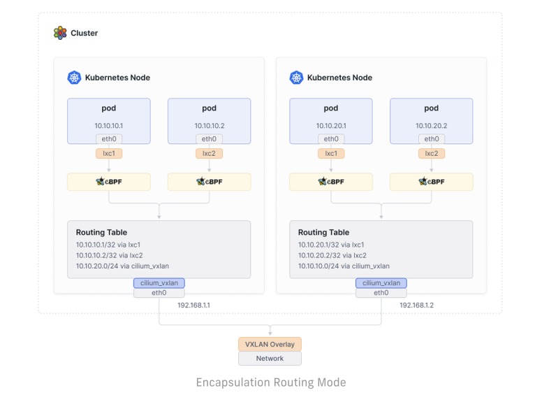</p>

- UDP 기반 캡슐화 프로토콜인 VXLAN 또는 Geneve를 사용하여 모든 노드 간에 터널 메시가 생성된다. [ [link](./_docs/Appendix%202.%20VxLAN%20and%20Geneve.md) ]

- 노드 간 통신 트래픽은 모두 VXLAN 또는 Geneve을 통해서 캡슐화된다.

- Pod 네트워크는 노드 네트워크의 영향을 받지 않기 때문에 환경에 종속되지 않고 간단하게 구성할 수 있는 장점이 있다.

- 캡슐화를 통해 헤더가 추가되면서 패킷의 효율이 미미하게 떨어지는데, 최적의 네트워크 성능 보장이 필요한 경우 Native/Direct 모드가 적합하다.

<br>

#### 1.2 Native Routing Mode

<p align=center>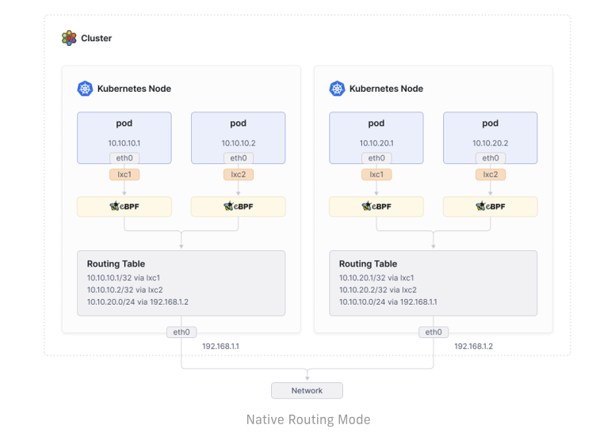</p>

- 캡슐화 기능 대신 Cilium의 네트워크 기능과 리눅스 커널의 라우팅 시스템을 이용해서 통신한다.

- 각 노드에는 Cilium Agent가 구성되고, Agent는 해당 노드의 Pod들에 대한 네트워크만 관리한다.

- 따라서 다른 노드로 향하는 트래픽은 리눅스 커널의 라우팅 시스템에 위임하여 처리된다.

  - 각 노드는 서로 다른 노드에 할당된 PodCIDR 정보를 인식하고, 커널 라우팅 테이블에 해당 노드로 향하는 경로가 추가된다.

  - L2 네트워크 프로토콜을 사용하는 경우 `auto-direct-node-routes` 옵션을 활성화하여 구성할 수 있다.

  - 또는, BGP 데몬을 활성화한 다음 서로의 라우팅 경로를 배포하도록 구성해야 한다.

<br>

#### 1.3 Native Routing Mode 파드간 통신 테스트

- 통신 테스트를 위해 샘플 파드(curl / webpod)를 생성한다.

  ```bash
  $ kubectl get po -owide
  NAME                      READY   STATUS    RESTARTS   AGE     IP             NODE         NOMINATED NODE   READINESS GATES
  curl-pod                  1/1     Running   0          2d23h   172.20.2.61    cilium-ctr   <none>           <none>
  netshoot-pod-w1           1/1     Running   0          55s     172.20.0.81    cilium-w1    <none>           <none>
  netshoot-pod-w2           1/1     Running   0          36s     172.20.1.174   cilium-w2    <none>           <none>
  ```

- WEB-POD의 IP를 변수에 저장 후 활용한다.

  ```bash
  export NETPODIP1=$(kubectl get -l app=curl pods --field-selector spec.nodeName=cilium-w1 -o jsonpath='{.items[0].status.podIP}')
  export NETPODIP2=$(kubectl get -l app=curl pods --field-selector spec.nodeName=cilium-w2 -o jsonpath='{.items[0].status.podIP}')
  ```

  ```bash
  $ echo $NETPODIP1
  172.20.0.81
  $ echo $NETPODIP2
  172.20.1.174
  ```

- `curl-pod`에서 `webpod`로 ICMP 패킷을 전달하고 Pod, Node에서 tcpdumpe를 확인하면 Pod IP로 통신하고 있는 것을 확인할 수 있다.

  ```bash
  kubectl exec -it curl-pod -- ping $NETPODIP1
  ```

  ```bash
  # cilium-ctr 노드에서 실행 한 tcpdump 결과 값
  $ tcpdump -i eth1 icmp
  11:47:48.295596 IP 172.20.2.61 > 172.20.0.81: ICMP echo request, id 96, seq 1, length 64
  11:47:48.295921 IP 172.20.0.81 > 172.20.2.61: ICMP echo reply, id 96, seq 1, length 64
  ...
  # cilium-w1 노드에서 실행 한 tcpdump 결과 값
  $ tcpdump -i eth1 icmp
  11:48:33.992812 IP 172.20.2.61 > 172.20.0.81: ICMP echo request, id 102, seq 1, length 64
  11:48:33.992915 IP 172.20.0.81 > 172.20.2.61: ICMP echo reply, id 102, seq 1, length 64
  ...
  # curl-pod에서 실행 한 tcpdump 결과 값
  $ kubectl exec -it curl-pod -- tcpdump -i eth0 icmp
  02:49:06.529171 IP curl-pod > 172.20.0.81: ICMP echo request, id 114, seq 1, length 64
  02:49:06.529437 IP 172.20.0.81 > curl-pod: ICMP echo reply, id 114, seq 1, length 64
  ...
  # netshoot-pod-w1에서 실행 한 tcpdump 결과 값
  $ kubectl exec -it netshoot-pod-w1 -- tcpdump -i eth0 icmp
  02:49:38.379248 IP 172.20.2.61 > netshoot-pod-w1: ICMP echo request, id 120, seq 1, length 64
  02:49:38.379321 IP netshoot-pod-w1 > 172.20.2.61: ICMP echo reply, id 120, seq 1, length 64
  ```

- 통신 경로를 살펴 보면 각 Pod에서는 자신의 노드의 `cilium_host` ip가 default routing 경로로 설정되어 있다.

  - `curl-pod` routing table

    ```bash
    $ kubectl exec -it curl-pod -- ip -c route
    default via 172.20.2.225 dev eth0 mtu 1500 
    172.20.2.225 dev eth0 scope link
    ```

  - `netshoot-pod-w1` routing table
  
    ```bash
    $ kubectl exec -it netshoot-pod-w1 -- ip -c route
    default via 172.20.0.51 dev eth0 mtu 1500 
    172.20.0.51 dev eth0 scope link 
    ```

  - `cilium-ctr`, `cilium-w1` 노드 `cilium_host` 인터페이스 IP 정보 조회

    ```bash
    $ for i in ctr w1 ; do echo ">> node : cilium-$i <<"; sshpass -p 'vagrant' ssh -o StrictHostKeyChecking=no vagrant@cilium-$i ip -c addr  | grep -A5 cilium_host@cilium_net ; echo; done;
    >> node : cilium-ctr <<
    5: cilium_host@cilium_net: <BROADCAST,MULTICAST,NOARP,UP,LOWER_UP> mtu 1500 qdisc noqueue state UP group default qlen 1000
        link/ether 56:e4:89:84:db:22 brd ff:ff:ff:ff:ff:ff
        inet 172.20.2.225/32 scope global cilium_host
          valid_lft forever preferred_lft forever
        inet6 fe80::54e4:89ff:fe84:db22/64 scope link 
          valid_lft forever preferred_lft forever

    >> node : cilium-w1 <<
    5: cilium_host@cilium_net: <BROADCAST,MULTICAST,NOARP,UP,LOWER_UP> mtu 1500 qdisc noqueue state UP group default qlen 1000
        link/ether 2a:36:dc:ae:dd:c3 brd ff:ff:ff:ff:ff:ff
        inet 172.20.0.51/32 scope global cilium_host
          valid_lft forever preferred_lft forever
        inet6 fe80::2836:dcff:feae:ddc3/64 scope link 
          valid_lft forever preferred_lft forever
    ```

- `cilium-ctr`과 `cilium-w1` 노드에서 각 파드로 향하는 패킷은 리눅스 커널 라우팅 정보를 기반으로 동작한다.

- 각 노드에 할당된 IP와 노드마다 할당된 PodCIDR, Routing 정보를 확인하면 다음과 같고, `cilium_host` 인터페이스로 전달된 Pod의 패킷이 이 정보를 기반으로 Direct로 전달되는 것을 알 수 있다.

  ```bash
  # cilium node ip information
  $ kubectl get ciliumnodes
  NAME         CILIUMINTERNALIP   INTERNALIP       AGE
  cilium-ctr   172.20.2.225       192.168.10.100   5d14h
  cilium-w1    172.20.0.51        192.168.10.101   5d14h
  cilium-w2    172.20.1.221       192.168.10.102   5d14h
  # cilium-ctr, cilium-w1 PodCIDR information
  $ kubectl get ciliumnode -o jsonpath='{range .items[*]}{.metadata.name}{" "}{.spec.ipam.podCIDRs[*]}{"\n"}{end}' | column -t
  cilium-ctr  172.20.2.0/24
  cilium-w1   172.20.0.0/24
  cilium-w2   172.20.1.0/24
  # cilium-ctr, ciliu,-w1 routeing table 
  $ for i in ctr w1 ; do echo ">> node : cilium-$i <<"; sshpass -p 'vagrant' ssh -o StrictHostKeyChecking=no vagrant@cilium-$i ip -c route show ; echo; done
  ne
  >> node : cilium-ctr <<
  default via 10.0.2.2 dev eth0 proto dhcp src 10.0.2.15 metric 100 
  10.0.2.0/24 dev eth0 proto kernel scope link src 10.0.2.15 metric 100 
  10.0.2.2 dev eth0 proto dhcp scope link src 10.0.2.15 metric 100 
  10.0.2.3 dev eth0 proto dhcp scope link src 10.0.2.15 metric 100 
  172.20.0.0/24 via 192.168.10.101 dev eth1 proto kernel 
  172.20.1.0/24 via 192.168.10.102 dev eth1 proto kernel 
  172.20.2.27 dev lxcf18fa3ec10e8 proto kernel scope link 
  172.20.2.61 dev lxceef064c53fb6 proto kernel scope link 
  172.20.2.106 dev lxc811fcf88a445 proto kernel scope link 
  192.168.10.0/24 dev eth1 proto kernel scope link src 192.168.10.100 

  >> node : cilium-w1 <<
  default via 10.0.2.2 dev eth0 proto dhcp src 10.0.2.15 metric 100 
  10.0.2.0/24 dev eth0 proto kernel scope link src 10.0.2.15 metric 100 
  10.0.2.2 dev eth0 proto dhcp scope link src 10.0.2.15 metric 100 
  10.0.2.3 dev eth0 proto dhcp scope link src 10.0.2.15 metric 100 
  172.20.0.65 dev lxcc4ed30f5773e proto kernel scope link 
  172.20.0.81 dev lxc50169b2b208e proto kernel scope link 
  172.20.0.106 dev lxc773f942306ed proto kernel scope link 
  172.20.0.218 dev lxc6bc61689249b proto kernel scope link 
  172.20.1.0/24 via 192.168.10.102 dev eth1 proto kernel 
  172.20.2.0/24 via 192.168.10.100 dev eth1 proto kernel 
  192.168.10.0/24 dev eth1 proto kernel scope link src 192.168.10.101
  ```

- `cilium-ctr` 노드에서 tcpdump 내용을 pcap 파일로 저장 후 정보를 확인하면 자신의 인터페이스와 `cilium-w1` 노드의 인터페이스의 MAC Address를 Source와 Destination 주소로 사용한다.

- `cilium-ctr`, `cilium-w1` 노드에서 각각 interface, arp cache table 정보를 조회해보면 서로 통신에 사용하는 같은 네트워크 `192.168.10.0/24`대역에 할당된 IP, MAC 주소임이 확인된다.

  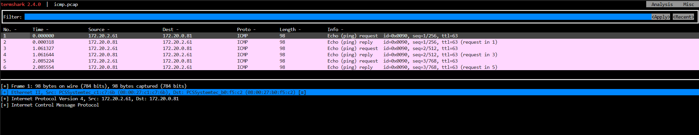

  ```bash
  # cilium-ctr, cilium-w1 node macc address information
  $ for i in ctr w1 ; do echo ">> node : cilium-$i <<"; sshpass -p 'vagrant' ssh -o StrictHostKeyChecking=no vagrant@cilium-$i ip -c addr | grep -A3 eth1 ; echo; done
  >> node : cilium-ctr <<
  3: eth1: <BROADCAST,MULTICAST,UP,LOWER_UP> mtu 1500 qdisc fq_codel state UP group default qlen 1000
      link/ether 08:00:27:c1:c7:6b brd ff:ff:ff:ff:ff:ff
      altname enp0s8
      inet 192.168.10.100/24 brd 192.168.10.255 scope global eth1
        valid_lft forever preferred_lft forever
      inet6 fe80::a00:27ff:fec1:c76b/64 scope link 
        valid_lft forever preferred_lft forever

  >> node : cilium-w1 <<
  3: eth1: <BROADCAST,MULTICAST,UP,LOWER_UP> mtu 1500 qdisc fq_codel state UP group default qlen 1000
      link/ether 08:00:27:b0:f5:c2 brd ff:ff:ff:ff:ff:ff
      altname enp0s8
      inet 192.168.10.101/24 brd 192.168.10.255 scope global eth1
        valid_lft forever preferred_lft forever
      inet6 fe80::a00:27ff:feb0:f5c2/64 scope link 
        valid_lft forever preferred_lft forever
  ```

  ```bash
  # cilium-ctr, cilum-w1 arp table information
  $ for i in ctr w1 ; do echo ">> node : cilium-$i <<"; sshpass -p 'vagrant' ssh -o StrictHostKeyChecking=no vagrant@cilium-$i arp -a ; echo; done
  >> node : cilium-ctr <<
  cilium-w1 (192.168.10.101) at 08:00:27:b0:f5:c2 [ether] on eth1
  ? (10.0.2.3) at 52:55:0a:00:02:03 [ether] on eth0
  Workspace (192.168.10.1) at 0a:00:27:00:00:00 [ether] on eth1
  ? (172.20.2.27) at 56:dc:67:22:28:5f [ether] on lxcf18fa3ec10e8
  cilium-w2 (192.168.10.102) at 08:00:27:74:3f:da [ether] on eth1
  _gateway (10.0.2.2) at 52:55:0a:00:02:02 [ether] on eth0
  ? (172.20.2.106) at 2e:41:42:6f:af:8b [ether] on lxc811fcf88a445

  >> node : cilium-w1 <<
  Workspace (192.168.10.1) at 0a:00:27:00:00:00 [ether] on eth1
  ? (192.168.10.100) at 08:00:27:c1:c7:6b [ether] on eth1       
  ? (192.168.10.102) at 08:00:27:74:3f:da [ether] on eth1
  ? (172.20.0.218) at f6:95:fa:fc:81:2b [ether] on lxc6bc61689249b
  ? (172.20.0.65) at ce:d6:39:bf:db:a1 [ether] on lxcc4ed30f5773e
  _gateway (10.0.2.2) at 52:55:0a:00:02:02 [ether] on eth0
  ? (10.0.2.3) at 52:55:0a:00:02:03 [ether] on eth0
  ```

- 동작과정 분석 결과 네트워크 처리 과정을 살펴보면 같은 노드에 배치된 파드간의 통신에는 eBPF를 사용해 Cilium이 처리하고, 노드간의 파드 통신에는 리눅스의 라우팅 시스템을 통해 통신한다는 것을 알 수 있다.

<br>

### 2. 클러스터 외부로 향하는 패킷 처리를 위한 Maquerading 처리

<p align=center>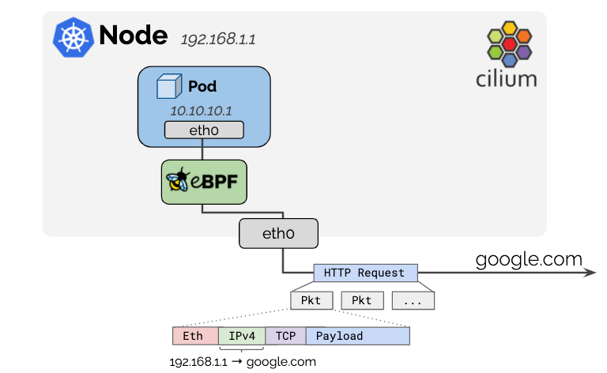</p>

- Cluster 내부의 IP CIDR은 RFC1918 Private Address Block을 사용하기 때문에 그 자체만으로는 Public 통신이 제한된다.

- Node IP 주소를 이용해 Cluster 외부로 나가는 모든 트래픽의 Source IP를 자동으로 Masquerade 한다.

- 노드 간의 통신에는 Encapsulation, Native Routing 방식으로 통신하면서 Cluster를 떠나는 트래픽에 대한 Masquerade 만 지원된다.

- eBPF(default) 방식과 iptablse masquerade 방식을 지원한다.

- Cluster 외부 네트워크 중에 사내망의 특별 IP 대역 처럼 Masquerading 없이 통신하고자 하는 경우 `ip-masq-agent` 설정을 통해 Node IP로의 NAT 없이 통신할 수 있다.

#### 2.1 Cluster와 같은 네트워크에 있지만 Cluster에 Join 되지 않은 VM 과의 통신 테스트

- `route VM`을 추가한 다음 Cluster 구성에 사용된 Node와 같은 IP CIDR 대역을 인터페이스에 할당했다.

- Cluster의 `curl-pod`에서 `route VM`(192.168.10.200) 방향으로 ICMP 패킷을 보내면 `curl-pod`가 배포된 노드의 IP로 변환되어 tcpdump에 기록된다.

  - cluster 노드 ip 정보 조회

    ```bash
    $ kubectl get ciliumnodes 
    NAME         CILIUMINTERNALIP   INTERNALIP       AGE
    cilium-ctr   172.20.2.28        192.168.10.100   24h
    cilium-w1    172.20.0.232       192.168.10.101   24h
    cilium-w2    172.20.1.18        192.168.10.102   24h
    ```

  - `curl-pod` 정보 조회

    ```bash
    $ kubectl get pod -owide
    NAME                      READY   STATUS    RESTARTS        AGE    IP             NODE         NOMINATED NODE   READINESS GATES
    curl-pod                  1/1     Running   1 (7h45m ago)   17h    172.20.2.80    cilium-ctr   <none>           <none>
    webpod-697b545f57-g9c5f   1/1     Running   0               17h    172.20.1.38    cilium-w2    <none>           <none>
    webpod-697b545f57-qgl6m   1/1     Running   0               148m   172.20.1.220   cilium-w2    <none>           <none>
    ```

  - `cilium-ctr`노드와 `route-vm` 노드의 ip, route 설정 정보 조회

    ```bash
    $ for i in ctr r ; do echo ">> node : cilium-$i <<"; sshpass -p 'vagrant' ssh -o StrictHostKeyChecking=no vagrant@cilium-$i ip -c -br addr show | grep eth1; echo; done
    >> node : cilium-ctr <<
    eth1             UP             192.168.10.100/24 fe80::a00:27ff:fe30:52ea/64 

    >> node : cilium-r <<
    eth1             UP             192.168.10.200/24 fe80::a00:27ff:fe7b:379e/64 
    ```

    ```bash
    $ for i in ctr r ; do echo ">> node : cilium-$i <<"; sshpass -p 'vagrant' ssh -o StrictHostKeyChecking=no vagrant@cilium-$i ip -c -br route show; echo; done
    >> node : cilium-ctr <<
    default via 10.0.2.2 dev eth0 proto dhcp src 10.0.2.15 metric 100 
    10.0.2.0/24 dev eth0 proto kernel scope link src 10.0.2.15 metric 100 
    10.0.2.2 dev eth0 proto dhcp scope link src 10.0.2.15 metric 100 
    10.0.2.3 dev eth0 proto dhcp scope link src 10.0.2.15 metric 100 
    172.20.0.0/24 via 192.168.10.101 dev eth1 proto kernel 
    172.20.1.0/24 via 192.168.10.102 dev eth1 proto kernel 
    172.20.2.5 dev lxc_health proto kernel scope link 
    172.20.2.244 dev lxc49adfa975abf proto kernel scope link 
    192.168.10.0/24 dev eth1 proto kernel scope link src 192.168.10.100 

    >> node : cilium-r <<
    default via 10.0.2.2 dev eth0 proto dhcp src 10.0.2.15 metric 100 
    10.0.2.0/24 dev eth0 proto kernel scope link src 10.0.2.15 metric 100 
    10.0.2.2 dev eth0 proto dhcp scope link src 10.0.2.15 metric 100 
    10.0.2.3 dev eth0 proto dhcp scope link src 10.0.2.15 metric 100 
    192.168.10.0/24 dev eth1 proto kernel scope link src 192.168.10.200 
    ```

  - `cilium-ctr`노드와 `route-vm` 통신 테스트

    ```bash
    $ ping 192.168.10.200
    PING 192.168.10.200 (192.168.10.200) 56(84) bytes of data.
    64 bytes from 192.168.10.200: icmp_seq=1 ttl=64 time=0.534 ms
    64 bytes from 192.168.10.200: icmp_seq=2 ttl=64 time=0.302 ms
    ```

    ```bash
    # route-vm tcpdump
    $ tcpdump -i eth1 icmp
    tcpdump: verbose output suppressed, use -v[v]... for full protocol decode
    listening on eth1, link-type EN10MB (Ethernet), snapshot length 262144 bytes
    17:25:16.014947 IP 192.168.10.100 > cilium-r: ICMP echo request, id 38246, seq 1, length 64
    17:25:16.014998 IP cilium-r > 192.168.10.100: ICMP echo reply, id 38246, seq 1, length 64
    17:25:17.050316 IP 192.168.10.100 > cilium-r: ICMP echo request, id 38246, seq 2, length 64
    17:25:17.050343 IP cilium-r > 192.168.10.100: ICMP echo reply, id 38246, seq 2, length 64
    ```

  - `curl-pod`에서 `cilium-ctr` 통신 테스트    

    ```bash
    $ kubectl exec -it curl-pod -- ping 192.168.10.100
    PING 192.168.10.100 (192.168.10.100) 56(84) bytes of data.
    64 bytes from 192.168.10.100: icmp_seq=1 ttl=64 time=0.052 ms
    64 bytes from 192.168.10.100: icmp_seq=2 ttl=64 time=0.052 ms
    ```

    ```bash
    # curl-pod tcpdump
    $ kubectl exec -it curl-pod -- tcpdump -i eth0 icmp
    tcpdump: verbose output suppressed, use -v[v]... for full protocol decode
    listening on eth0, link-type EN10MB (Ethernet), snapshot length 262144 bytes
    08:38:05.178133 IP curl-pod > 192.168.10.100: ICMP echo request, id 25, seq 1, length 64
    08:38:05.178186 IP 192.168.10.100 > curl-pod: ICMP echo reply, id 25, seq 1, length 64
    08:38:06.216058 IP curl-pod > 192.168.10.100: ICMP echo request, id 25, seq 2, length 64
    08:38:06.216096 IP 192.168.10.100 > curl-pod: ICMP echo reply, id 25, seq 2, length 64
    ```

  - `curl-pod`에서 `route-vm` 통신 테스트

    ```bash
    $ kubectl exec -it curl-pod -- ping 192.168.10.200
    PING 192.168.10.200 (192.168.10.200) 56(84) bytes of data.
    64 bytes from 192.168.10.200: icmp_seq=1 ttl=63 time=0.288 ms
    64 bytes from 192.168.10.200: icmp_seq=2 ttl=63 time=0.289 ms
    ```

    ```bash
    # curl-pod tcpdump
    $ kubectl exec -it curl-pod -- tcpdump -i eth0 icmp
    tcpdump: verbose output suppressed, use -v[v]... for full protocol decode
    listening on eth0, link-type EN10MB (Ethernet), snapshot length 262144 bytes
    08:41:05.853488 IP curl-pod > 192.168.10.200: ICMP echo request, id 48, seq 1, length 64
    08:41:05.853771 IP 192.168.10.200 > curl-pod: ICMP echo reply, id 48, seq 1, length 64
    08:41:06.888037 IP curl-pod > 192.168.10.200: ICMP echo request, id 48, seq 2, length 64
    08:41:06.888305 IP 192.168.10.200 > curl-pod: ICMP echo reply, id 48, seq 2, length 64

    # cilium-ctr tcpdump
    $ tcpdump -i eth1 icmp
    tcpdump: verbose output suppressed, use -v[v]... for full protocol decode
    listening on eth1, link-type EN10MB (Ethernet), snapshot length 262144 bytes
    17:41:05.853517 IP cilium-ctr > 192.168.10.200: ICMP echo request, id 42759, seq 1, length 64
    17:41:05.853771 IP 192.168.10.200 > cilium-ctr: ICMP echo reply, id 42759, seq 1, length 64
    17:41:06.888056 IP cilium-ctr > 192.168.10.200: ICMP echo request, id 42759, seq 2, length 64
    17:41:06.888305 IP 192.168.10.200 > cilium-ctr: ICMP echo reply, id 42759, seq 2, length 64
    
    # cilium-r tcpdump
    $ tcpdump -i eth1 icmp
    tcpdump: verbose output suppressed, use -v[v]... for full protocol decode
    listening on eth1, link-type EN10MB (Ethernet), snapshot length 262144 bytes
    17:41:04.073076 IP 192.168.10.100 > cilium-r: ICMP echo request, id 42759, seq 1, length 64   # curl-pod의 172.20.2.80 가 아닌 cilium-ctr의 192.168.10.100 이 찍힌다.
    17:41:04.073113 IP cilium-r > 192.168.10.100: ICMP echo reply, id 42759, seq 1, length 64
    17:41:05.108132 IP 192.168.10.100 > cilium-r: ICMP echo request, id 42759, seq 2, length 64
    17:41:05.108166 IP cilium-r > 192.168.10.100: ICMP echo reply, id 42759, seq 2, length 64
    ```

<br>

#### 2.2 Cluster 외부의 다른 네트워크 대역(10.0.0.0/16)에 있는 네트워크와의 통신 테스트

- router VM에 Dummy Interface(loop1, loop2)를 만들어 두고, 해당 대역과의 통신을 테스트 한다.

  ```bash
  $ ip -c -br addr show
  lo               UNKNOWN        127.0.0.1/8 ::1/128 
  eth0             UP             10.0.2.15/24 metric 100 fd17:625c:f037:2:a00:27ff:fe6b:69c9/64 fe80::a00:27ff:fe6b:69c9/64 
  eth1             UP             192.168.10.200/24 fe80::a00:27ff:fe7b:379e/64 
  loop1            UNKNOWN        10.10.1.200/24 fe80::c837:49ff:fe98:2de4/64 
  loop2            UNKNOWN        10.10.2.200/24 fe80::fc26:82ff:fec4:214/64 
  ```

- Pod 에서는 Masquerading 과정을 거쳐 노드의 129.168.10.0 대역의 IP로 NAT 되어 통신되기 때문에 별도의 라우팅 경로 설정 없이 통신이 가능하다.

  ```bash
  $ ip -c -br route show
  default via 10.0.2.2 dev eth0 proto dhcp src 10.0.2.15 metric 100 
  10.0.2.0/24 dev eth0 proto kernel scope link src 10.0.2.15 metric 100 
  10.0.2.2 dev eth0 proto dhcp scope link src 10.0.2.15 metric 100 
  10.0.2.3 dev eth0 proto dhcp scope link src 10.0.2.15 metric 100 
  10.10.1.0/24 dev loop1 proto kernel scope link src 10.10.1.200 
  10.10.2.0/24 dev loop2 proto kernel scope link src 10.10.2.200 
  192.168.10.0/24 dev eth1 proto kernel scope link src 192.168.10.200
  ```

- `cilium-ctr`에서 `route-vm` Dummy Interface(loop1)와 통신 테스트

  ```bash
  ping 10.10.1.200
  PING 10.10.1.200 (10.10.1.200) 56(84) bytes of data.
  64 bytes from 10.10.1.200: icmp_seq=1 ttl=64 time=0.309 ms
  64 bytes from 10.10.1.200: icmp_seq=2 ttl=64 time=0.294 ms
  ```

- `curl-pod`에서 `route-vm`의 Dummy Interface(loop1)와 통신 테스트

  ```bash
  $ kubectl exec -it curl-pod -- curl -s 10.10.1.200
  <h1>Web Server : router</h1>
  ```

  ```bash
  # curl-pod tcpdump
  $ k exec -it curl-pod -- tcpdump -i eth0 tcp port 80
  tcpdump: verbose output suppressed, use -v[v]... for full protocol decode
  listening on eth0, link-type EN10MB (Ethernet), snapshot length 262144 bytes
  22:08:00.208734 IP curl-pod.52094 > 10.10.1.200.80: Flags [S], seq 237902051, win 64240, options [mss 1460,sackOK,TS val 633285940 ecr 0,nop,wscale 7], length 0
  22:08:00.209027 IP 10.10.1.200.80 > curl-pod.52094: Flags [S.], seq 674184139, ack 237902052, win 65160, options [mss 1460,sackOK,TS val 3608092320 ecr 633285940,nop,wscale 7], length 0
  22:08:00.209062 IP curl-pod.52094 > 10.10.1.200.80: Flags [.], ack 1, win 502, options [nop,nop,TS val 633285941 ecr 3608092320], length 0
  22:08:00.209193 IP curl-pod.52094 > 10.10.1.200.80: Flags [P.], seq 1:76, ack 1, win 502, options [nop,nop,TS val 633285941 ecr 3608092320], length 75: HTTP: GET / HTTP/1.1
  22:08:00.209335 IP 10.10.1.200.80 > curl-pod.52094: Flags [.], ack 76, win 509, options [nop,nop,TS val 3608092320 ecr 633285941], length 0
  22:08:00.209758 IP 10.10.1.200.80 > curl-pod.52094: Flags [P.], seq 1:257, ack 76, win 509, options [nop,nop,TS val 3608092320 ecr 633285941], length 256: HTTP: HTTP/1.1 200 OK
  22:08:00.209782 IP curl-pod.52094 > 10.10.1.200.80: Flags [.], ack 257, win 501, options [nop,nop,TS val 633285941 ecr 3608092320], length 0
  22:08:00.209925 IP curl-pod.52094 > 10.10.1.200.80: Flags [F.], seq 76, ack 257, win 501, options [nop,nop,TS val 633285941 ecr 3608092320], length 0
  22:08:00.210141 IP 10.10.1.200.80 > curl-pod.52094: Flags [F.], seq 257, ack 77, win 509, options [nop,nop,TS val 3608092321 ecr 633285941], length 0
  22:08:00.210162 IP curl-pod.52094 > 10.10.1.200.80: Flags [.], ack 258, win 501, options [nop,nop,TS val 633285942 ecr 3608092321], length 0
  # cilium-ctr tcpdump
  $ tcpdump -i eth1 tcp port 80
  tcpdump: verbose output suppressed, use -v[v]... for full protocol decode
  listening on eth1, link-type EN10MB (Ethernet), snapshot length 262144 bytes
  07:08:00.208767 IP cilium-ctr.52094 > 10.10.1.200.http: Flags [S], seq 237902051, win 64240, options [mss 1460,sackOK,TS val 633285940 ecr 0,nop,wscale 7], length 0
  07:08:00.209027 IP 10.10.1.200.http > cilium-ctr.52094: Flags [S.], seq 674184139, ack 237902052, win 65160, options [mss 1460,sackOK,TS val 3608092320 ecr 633285940,nop,wscale 7], length 0
  07:08:00.209080 IP cilium-ctr.52094 > 10.10.1.200.http: Flags [.], ack 1, win 502, options [nop,nop,TS val 633285941 ecr 3608092320], length 0
  07:08:00.209211 IP cilium-ctr.52094 > 10.10.1.200.http: Flags [P.], seq 1:76, ack 1, win 502, options [nop,nop,TS val 633285941 ecr 3608092320], length 75: HTTP: GET / HTTP/1.1
  07:08:00.209335 IP 10.10.1.200.http > cilium-ctr.52094: Flags [.], ack 76, win 509, options [nop,nop,TS val 3608092320 ecr 633285941], length 0
  07:08:00.209758 IP 10.10.1.200.http > cilium-ctr.52094: Flags [P.], seq 1:257, ack 76, win 509, options [nop,nop,TS val 3608092320 ecr 633285941], length 256: HTTP: HTTP/1.1 200 OK
  07:08:00.209802 IP cilium-ctr.52094 > 10.10.1.200.http: Flags [.], ack 257, win 501, options [nop,nop,TS val 633285941 ecr 3608092320], length 0
  07:08:00.209967 IP cilium-ctr.52094 > 10.10.1.200.http: Flags [F.], seq 76, ack 257, win 501, options [nop,nop,TS val 633285941 ecr 3608092320], length 0
  07:08:00.210141 IP 10.10.1.200.http > cilium-ctr.52094: Flags [F.], seq 257, ack 77, win 509, options [nop,nop,TS val 3608092321 ecr 633285941], length 0
  07:08:00.210184 IP cilium-ctr.52094 > 10.10.1.200.http: Flags [.], ack 258, win 501, options [nop,nop,TS val 633285942 ecr 3608092321], length 0
  # cilium-r tcpdump
  $ tcpdump -i eth1 tcp port 80
  tcpdump: verbose output suppressed, use -v[v]... for full protocol decode
  listening on eth1, link-type EN10MB (Ethernet), snapshot length 262144 bytes
  07:08:00.340767 IP 192.168.10.100.52094 > cilium-r.http: Flags [S], seq 237902051, win 64240, options [mss 1460,sackOK,TS val 633285940 ecr 0,nop,wscale 7], length 0
  07:08:00.340802 IP cilium-r.http > 192.168.10.100.52094: Flags [S.], seq 674184139, ack 237902052, win 65160, options [mss 1460,sackOK,TS val 3608092320 ecr 633285940,nop,wscale 7], length 0
  07:08:00.341009 IP 192.168.10.100.52094 > cilium-r.http: Flags [.], ack 1, win 502, options [nop,nop,TS val 633285941 ecr 3608092320], length 0
  07:08:00.341134 IP 192.168.10.100.52094 > cilium-r.http: Flags [P.], seq 1:76, ack 1, win 502, options [nop,nop,TS val 633285941 ecr 3608092320], length 75: HTTP: GET / HTTP/1.1
  07:08:00.341159 IP cilium-r.http > 192.168.10.100.52094: Flags [.], ack 76, win 509, options [nop,nop,TS val 3608092320 ecr 633285941], length 0
  07:08:00.341565 IP cilium-r.http > 192.168.10.100.52094: Flags [P.], seq 1:257, ack 76, win 509, options [nop,nop,TS val 3608092320 ecr 633285941], length 256: HTTP: HTTP/1.1 200 OK
  07:08:00.341720 IP 192.168.10.100.52094 > cilium-r.http: Flags [.], ack 257, win 501, options [nop,nop,TS val 633285941 ecr 3608092320], length 0
  07:08:00.341894 IP 192.168.10.100.52094 > cilium-r.http: Flags [F.], seq 76, ack 257, win 501, options [nop,nop,TS val 633285941 ecr 3608092320], length 0
  07:08:00.341960 IP cilium-r.http > 192.168.10.100.52094: Flags [F.], seq 257, ack 77, win 509, options [nop,nop,TS val 3608092321 ecr 633285941], length 0
  07:08:00.342107 IP 192.168.10.100.52094 > cilium-r.http: Flags [.], ack 258, win 501, options [nop,nop,TS val 633285942 ecr 3608092321], length 0
  ```

#### 2.3 Cluster 외부의 다른 네트워크 대역(10.0.0.0/16)과 Masquerade 없이 통신하도록 설정하는 방법

- Cluster 외부의 다른 네트워크와 Pod의 IP 대역으로 NAT 없이 통신 하기 위해서는 `ip-masq-agent`를 활성화 해야 한다.

  - helm을 통해 cilium을 생성할 때 `ipMasqAgent.enabled=true` 파라미터를 추가해야 한다.

  - `ipMasqAgent` 파라미터와 연동해서 Masquerade 없이 통신할 Target CIDR 값을 `ipMasqAgent.config.nonMasqueradeCIDRs` 파라미터로 설정할 수 있다.

    ```bash
    helm upgrade cilium cilium/cilium --namespace kube-system --reuse-values \
    --set ipMasqAgent.enabled=true --set ipMasqAgent.config.nonMasqueradeCIDRs='{10.10.1.0/24,10.10.2.0/24}'
    ```

  - 설정 결과 확인 및 추가 설정 정보 수정은 ConfigMap `ip-masq-agent`을 이용한다.

    ```bash
    $ kubectl get cm ip-masq-agent -n kube-system -oyaml
    apiVersion: v1
    data:
      config: '{"nonMasqueradeCIDRs":["10.10.1.0/24","10.10.2.0/24"]}'
    kind: ConfigMap
    metadata:
      annotations:
        meta.helm.sh/release-name: cilium
        meta.helm.sh/release-namespace: kube-system
      creationTimestamp: "2025-07-30T02:26:52Z"
      labels:
        app.kubernetes.io/managed-by: Helm
      name: ip-masq-agent
      namespace: kube-system
      resourceVersion: "311691"
      uid: edcd486d-97a2-493f-b1db-0574bd47315f
      ```

- Cluster 내부 리소스와 통신하려는 사내망의 네트워크에서도 Cluster 내부 리소스와 통신할 경로 값이 설정되어 있어야 한다.

  - `ipMasqAgent` 설정 후 라우팅 정보를 추가 하지 않은 상태에서 동일하게 `curl-pod`에서 HTTP 트래픽을 사용하면 응답이 오지 않는다.

    ```bash
    $ kubectl exec -it curl-pod -- curl -s 10.10.1.200
    ```

    ```bash
    # cilium-ctr tcpdump
    $ tcpdump -i eth1 tcp port 80
    tcpdump: verbose output suppressed, use -v[v]... for full protocol decode
    listening on eth1, link-type EN10MB (Ethernet), snapshot length 262144 bytes
    11:40:46.764927 IP 172.20.2.80.40900 > 10.10.1.200.http: Flags [S], seq 53382965, win 64240, options [mss 1460,sackOK,TS val 649652496 ecr 0,nop,wscale 7], length 0
    11:40:47.816066 IP 172.20.2.80.40900 > 10.10.1.200.http: Flags [S], seq 53382965, win 64240, options [mss 1460,sackOK,TS val 649653548 ecr 0,nop,wscale 7], length 0
    11:40:48.840032 IP 172.20.2.80.40900 > 10.10.1.200.http: Flags [S], seq 53382965, win 64240, options [mss 1460,sackOK,TS val 649654572 ecr 0,nop,wscale 7], length 0
    11:40:49.864038 IP 172.20.2.80.40900 > 10.10.1.200.http: Flags [S], seq 53382965, win 64240, options [mss 1460,sackOK,TS val 649655596 ecr 0,nop,wscale 7], length 0
    11:40:50.888112 IP 172.20.2.80.40900 > 10.10.1.200.http: Flags [S], seq 53382965, win 64240, options [mss 1460,sackOK,TS val 649656620 ecr 0,nop,wscale 7], length 0
    11:40:51.912075 IP 172.20.2.80.40900 > 10.10.1.200.http: Flags [S], seq 53382965, win 64240, options [mss 1460,sackOK,TS val 649657644 ecr 0,nop,wscale 7], length 0
    11:40:53.960031 IP 172.20.2.80.40900 > 10.10.1.200.http: Flags [S], seq 53382965, win 64240, options [mss 1460,sackOK,TS val 649659692 ecr 0,nop,wscale 7], length 0
    11:40:57.992070 IP 172.20.2.80.40900 > 10.10.1.200.http: Flags [S], seq 53382965, win 64240, options [mss 1460,sackOK,TS val 649663724 ecr 0,nop,wscale 7], length 0
    11:41:06.056072 IP 172.20.2.80.40900 > 10.10.1.200.http: Flags [S], seq 53382965, win 64240, options [mss 1460,sackOK,TS val 649671788 ecr 0,nop,wscale 7], length 0
    11:41:22.440062 IP 172.20.2.80.40900 > 10.10.1.200.http: Flags [S], seq 53382965, win 64240, options [mss 1460,sackOK,TS val 649688172 ecr 0,nop,wscale 7], length 0
    # cilium-r tcpdump
    $ tcpdump -i eth1 tcp port 80
    tcpdump: verbose output suppressed, use -v[v]... for full protocol decode
    listening on eth1, link-type EN10MB (Ethernet), snapshot length 262144 bytes
    11:40:46.770814 IP 172.20.2.80.40900 > cilium-r.http: Flags [S], seq 53382965, win 64240, options [mss 1460,sackOK,TS val 649652496 ecr 0,nop,wscale 7], length 0
    11:40:47.821961 IP 172.20.2.80.40900 > cilium-r.http: Flags [S], seq 53382965, win 64240, options [mss 1460,sackOK,TS val 649653548 ecr 0,nop,wscale 7], length 0
    11:40:48.845932 IP 172.20.2.80.40900 > cilium-r.http: Flags [S], seq 53382965, win 64240, options [mss 1460,sackOK,TS val 649654572 ecr 0,nop,wscale 7], length 0
    11:40:49.869943 IP 172.20.2.80.40900 > cilium-r.http: Flags [S], seq 53382965, win 64240, options [mss 1460,sackOK,TS val 649655596 ecr 0,nop,wscale 7], length 0
    11:40:50.893936 IP 172.20.2.80.40900 > cilium-r.http: Flags [S], seq 53382965, win 64240, options [mss 1460,sackOK,TS val 649656620 ecr 0,nop,wscale 7], length 0
    11:40:51.917980 IP 172.20.2.80.40900 > cilium-r.http: Flags [S], seq 53382965, win 64240, options [mss 1460,sackOK,TS val 649657644 ecr 0,nop,wscale 7], length 0
    11:40:53.965934 IP 172.20.2.80.40900 > cilium-r.http: Flags [S], seq 53382965, win 64240, options [mss 1460,sackOK,TS val 649659692 ecr 0,nop,wscale 7], length 0
    11:40:57.997976 IP 172.20.2.80.40900 > cilium-r.http: Flags [S], seq 53382965, win 64240, options [mss 1460,sackOK,TS val 649663724 ecr 0,nop,wscale 7], length 0
    11:41:06.062041 IP 172.20.2.80.40900 > cilium-r.http: Flags [S], seq 53382965, win 64240, options [mss 1460,sackOK,TS val 649671788 ecr 0,nop,wscale 7], length 0
    11:41:22.445981 IP 172.20.2.80.40900 > cilium-r.http: Flags [S], seq 53382965, win 64240, options [mss 1460,sackOK,TS val 649688172 ecr 0,nop,wscale 7], length 0
    11:41:54.702038 IP 172.20.2.80.40900 > cilium-r.http: Flags [S], seq 53382965, win 64240, options [mss 1460,sackOK,TS val 649720428 ecr 0,nop,wscale 7], length 0
    ```

  - `route-vm`의 tcpdump 결과 172.20.2.80(curl-pod) IP 값이 조회되는데, route-vm의 라우팅 경로에는 172.20.0.0/24 CIDR 대역에 대한 경로 정보가 없다.

    ```bash
    $ ip -c -br route show
    default via 10.0.2.2 dev eth0 proto dhcp src 10.0.2.15 metric 100 
    10.0.2.0/24 dev eth0 proto kernel scope link src 10.0.2.15 metric 100 
    10.0.2.2 dev eth0 proto dhcp scope link src 10.0.2.15 metric 100 
    10.0.2.3 dev eth0 proto dhcp scope link src 10.0.2.15 metric 100 
    10.10.1.0/24 dev loop1 proto kernel scope link src 10.10.1.200 
    10.10.2.0/24 dev loop2 proto kernel scope link src 10.10.2.200 
    192.168.10.0/24 dev eth1 proto kernel scope link src 192.168.10.200
    ```

  - 각 노드에는 Pod에 할당할 PodCIDR이 정해져 있다. 각 PodCIDR을 해당 노드의 인터페이스로 향하는 경로를 설정해야 한다.

    ```bash
    $ kubectl get ciliumnode -o jsonpath='{range .items[*]}{.metadata.name}{" "}{.spec.ipam.podCIDRs[*]}{"\n"}{end}' | column -t
    cilium-ctr  172.20.2.0/24
    cilium-w1   172.20.0.0/24
    cilium-w2   172.20.1.0/24
    ```

    ```bash
    kubectl get ciliumnode
    NAME         CILIUMINTERNALIP   INTERNALIP       AGE
    cilium-ctr   172.20.2.28        192.168.10.100   43h
    cilium-w1    172.20.0.232       192.168.10.101   43h
    cilium-w2    172.20.1.18        192.168.10.102   43h
    ```

    ```bash
    # cilium-r 노드에서 진행
    ip route add 172.20.2.0/24 via 192.168.10.100
    ip route add 172.20.0.0/24 via 192.168.10.101
    ip route add 172.20.1.0/24 via 192.168.10.102
    ```

  - `route-vm` 라우팅 경로 추가 정보 확인 

    ```bash
    ip -c -br route show
    default via 10.0.2.2 dev eth0 proto dhcp src 10.0.2.15 metric 100 
    10.0.2.0/24 dev eth0 proto kernel scope link src 10.0.2.15 metric 100 
    10.0.2.2 dev eth0 proto dhcp scope link src 10.0.2.15 metric 100 
    10.0.2.3 dev eth0 proto dhcp scope link src 10.0.2.15 metric 100 
    10.10.1.0/24 dev loop1 proto kernel scope link src 10.10.1.200 
    10.10.2.0/24 dev loop2 proto kernel scope link src 10.10.2.200 
    172.20.0.0/24 via 192.168.10.101 dev eth1 
    172.20.1.0/24 via 192.168.10.102 dev eth1 
    172.20.2.0/24 via 192.168.10.100 dev eth1 
    192.168.10.0/24 dev eth1 proto kernel scope link src 192.168.10.200
    ```

  - 라우팅 경로 추가 후 다시 통신 테스트 결과 이번에는 응답이 오는 것을 확인할 수 있다.
  
    ```bash
    $ kubectl exec -it curl-pod -- curl -s 10.10.1.200
    <h1>Web Server : router</h1>
    ```

    ```bash
    # cilium-ctr tcpdump 
    $ tcpdump -i eth1 tcp port 80
    tcpdump: verbose output suppressed, use -v[v]... for full protocol decode
    listening on eth1, link-type EN10MB (Ethernet), snapshot length 262144 bytes
    11:52:53.344844 IP 172.20.2.80.34686 > 10.10.1.200.http: Flags [S], seq 509259083, win 64240, options [mss 1460,sackOK,TS val 650379076 ecr 0,nop,wscale 7], length 0
    11:52:53.345103 IP 10.10.1.200.http > 172.20.2.80.34686: Flags [S.], seq 4247483222, ack 509259084, win 65160, options [mss 1460,sackOK,TS val 4031452192 ecr 650379076,nop,wscale 7], length 0
    11:52:53.345177 IP 172.20.2.80.34686 > 10.10.1.200.http: Flags [.], ack 1, win 502, options [nop,nop,TS val 650379077 ecr 4031452192], length 0
    11:52:53.345341 IP 172.20.2.80.34686 > 10.10.1.200.http: Flags [P.], seq 1:76, ack 1, win 502, options [nop,nop,TS val 650379077 ecr 4031452192], length 75: HTTP: GET / HTTP/1.1
    11:52:53.345454 IP 10.10.1.200.http > 172.20.2.80.34686: Flags [.], ack 76, win 509, options [nop,nop,TS val 4031452192 ecr 650379077], length 0
    11:52:53.345757 IP 10.10.1.200.http > 172.20.2.80.34686: Flags [P.], seq 1:257, ack 76, win 509, options [nop,nop,TS val 4031452192 ecr 650379077], length 256: HTTP: HTTP/1.1 200 OK
    11:52:53.345793 IP 172.20.2.80.34686 > 10.10.1.200.http: Flags [.], ack 257, win 501, options [nop,nop,TS val 650379077 ecr 4031452192], length 0
    11:52:53.346009 IP 172.20.2.80.34686 > 10.10.1.200.http: Flags [F.], seq 76, ack 257, win 501, options [nop,nop,TS val 650379078 ecr 4031452192], length 0
    11:52:53.346181 IP 10.10.1.200.http > 172.20.2.80.34686: Flags [F.], seq 257, ack 77, win 509, options [nop,nop,TS val 4031452193 ecr 650379078], length 0
    11:52:53.346227 IP 172.20.2.80.34686 > 10.10.1.200.http: Flags [.], ack 258, win 501, options [nop,nop,TS val 650379078 ecr 4031452193], length 0
    # cilium-r tcpdump
    $ tcpdump -i eth1 tcp port 80
    tcpdump: verbose output suppressed, use -v[v]... for full protocol decode
    listening on eth1, link-type EN10MB (Ethernet), snapshot length 262144 bytes
    11:52:53.350732 IP 172.20.2.80.34686 > cilium-r.http: Flags [S], seq 509259083, win 64240, options [mss 1460,sackOK,TS val 650379076 ecr 0,nop,wscale 7], length 0
    11:52:53.350774 IP cilium-r.http > 172.20.2.80.34686: Flags [S.], seq 4247483222, ack 509259084, win 65160, options [mss 1460,sackOK,TS val 4031452192 ecr 650379076,nop,wscale 7], length 0
    11:52:53.350964 IP 172.20.2.80.34686 > cilium-r.http: Flags [.], ack 1, win 502, options [nop,nop,TS val 650379077 ecr 4031452192], length 0
    11:52:53.351125 IP 172.20.2.80.34686 > cilium-r.http: Flags [P.], seq 1:76, ack 1, win 502, options [nop,nop,TS val 650379077 ecr 4031452192], length 75: HTTP: GET / HTTP/1.1
    11:52:53.351146 IP cilium-r.http > 172.20.2.80.34686: Flags [.], ack 76, win 509, options [nop,nop,TS val 4031452192 ecr 650379077], length 0
    11:52:53.351427 IP cilium-r.http > 172.20.2.80.34686: Flags [P.], seq 1:257, ack 76, win 509, options [nop,nop,TS val 4031452192 ecr 650379077], length 256: HTTP: HTTP/1.1 200 OK
    11:52:53.351586 IP 172.20.2.80.34686 > cilium-r.http: Flags [.], ack 257, win 501, options [nop,nop,TS val 650379077 ecr 4031452192], length 0
    11:52:53.351797 IP 172.20.2.80.34686 > cilium-r.http: Flags [F.], seq 76, ack 257, win 501, options [nop,nop,TS val 650379078 ecr 4031452192], length 0
    11:52:53.351856 IP cilium-r.http > 172.20.2.80.34686: Flags [F.], seq 257, ack 77, win 509, options [nop,nop,TS val 4031452193 ecr 650379078], length 0
    11:52:53.352005 IP 172.20.2.80.34686 > cilium-r.http: Flags [.], ack 258, win 501, options [nop,nop,TS val 650379078 ecr 4031452193], length 0
    ```

  - 소규모 작업 환경에서는 관리자가 수동으로 라우팅 설정하는 것이 가능하지만 대규모 환경에서는 BGP를 이용해 동적으로 라우팅 정보를 전파하는 것이 좋다.

<br>

### 3. 네트워크 엔드포인트(컨테이너/LB) IP 관리를 위한 IPAM (IP Address Management)

<p align=center>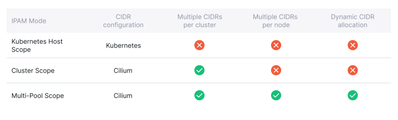</p>

- 네트워크 엔드포인트(컨테이너 등)에서 사용할 IP 주소를 할당하고 관리하는 역할을 한다.

- IPAM을 한 번 설정한 상태에서 모드를 변경하는 것은 권장되지 않는다. 새 IPAM 구성으로 새로운 쿠버네티스 클러스터를 생성하는 것이 좋다.

- 배포 환경, 사용자의 요구사항에 따라 다양하게 구성이 가능하도록 7개의 배포 모드를 지원한다. [ [docs](https://docs.cilium.io/en/stable/network/concepts/ipam/) ]

<br>

#### 3.1 Kubernetes Host Scope

<p align=center>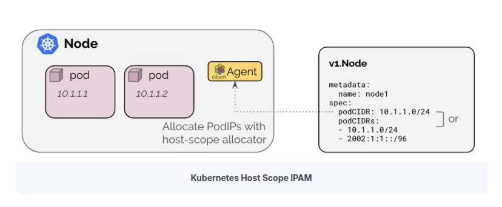</p>

- `Kubernetes Controller Manager`가 Node에 할당한 PodCIDR을 사용한다.

- 이 모드는 간단하게 구현이 가능하지만 PodCIDR을 유연하게 관리하는 것은 제약이 많다.

  - 클러스터 전체에 하나의 PodCIDR 구성만 지원한다.

  - 클러스터의 PodCIDR이 고갈되었을 때 클러스터나 개별 노드에 PodCIDR을 추가하는 것이 불가능하다.

  - 초기 클러스터 배포 시 정확하게 노드별 IP 주소 계획을 수립해서 사용해야 한다.

<br>

#### 3.2 Cluster Scope IPAM (Default)

<p align=center>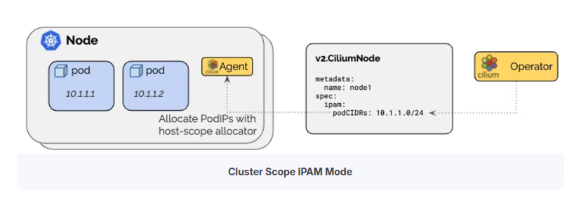</p>

- Kubernetes Host Scope와 동일하게 Node에 할당된 PodCIDR을 활용해 IP를 할당한다.

- Node에 할당된 PodCIDR을 할당하는 주체가 `Kubernetes Controller Manager`가 아닌 `Cilium Operator`가 된다.

- Cluster Scope IPAM의 장점은 여러 CIDR을 할당할 수 있다는 것이다.

- 하지만, 할당된 IP Pool의 주소 고갈 문제를 완전히 해결하지는 못하는 문제는 Kubernetes Host Scope와 동일하다.

##### Cluster Scope IPAM 모드에서 CIDR 추가 테스트

- cluster scope ipam cidr 설정 파일을 생성한다.

  ```yaml
  # cilium-values.yaml
  ---
  ipam:
    mode: cluster-pool
    operator:
      clusterPoolIPv4MaskSize: 29
      clusterPoolIPv4PodCIDRList:
        - "172.20.42.0/28"
        - "172.20.84.0/28"
  ```

- Helm 도구를 이용해서 1.17.5 Cilium을 설치하면서 설정파일을 `-f` 옵션으로 할당한다.

  ```bash
  helm repo add cilium https://helm.cilium.io/
  helm repo update
  helm install cilium cilium/cilium -n kube-system --version 1.17.5 -f cilium-values.yaml
  ```

- Cilium CLI를 이용해 배포 결과를 확인한다. (CLI는 별도 설치 필요)

  ```bash
  $ cilium config view | grep cluster-pool
  cluster-pool-ipv4-cidr                            172.20.42.0/28 172.20.84.0/28
  cluster-pool-ipv4-mask-size                       29
  ipam                                              cluster-pool
  ```

- `172.20.42.0/28`, `172.20.84.0/28` CIDR 이 외에 추가 CIDR을 파일에 반영 후 Helm을 업데이트한다.

  ```yaml
  # cilium-values.yaml
  ---
  ipam:
    mode: cluster-pool
    operator:
      clusterPoolIPv4MaskSize: 29
      clusterPoolIPv4PodCIDRList:
        - "172.20.42.0/28"
        - "172.20.84.0/28"
        - "10.0.0.0/28"
  ```

  ```bash
  helm upgrade cilium cilium/cilium -n kube-system --version 1.17.5 -f cilium-values.yaml
  ```

- Cilium CLI를 이용해 배포 결과를 확인한다.

  ```bash
  $ cilium config view | grep cluster-pool
  cluster-pool-ipv4-cidr                            172.20.42.0/28 172.20.84.0/28 10.0.0.0/28
  cluster-pool-ipv4-mask-size                       29
  ipam                                              cluster-pool
  ```

- node에 할당된 cidr 정보를 확인한다.

  ```bash
  $ kubectl get ciliumnode -o jsonpath='{range .items[*]}{.metadata.name}{" "}{.spec.ipam.podCIDRs[*]}{"\n"}{end}' | column -t
  cilium-ctr  172.20.84.0/29
  cilium-w1   172.20.42.0/29
  cilium-w2   172.20.42.8/29
  ```

##### IP Pool이 고갈된 상황 테스트

- `cilium-w1`, `cilium-w2` 노드에 할당된 CIDR Pool 정보와 남은 IP의 개수를 확인한다.

  ```bash
  $ c1dbg status | grep IPAM
  IPAM:                    IPv4: 3/6 allocated from 172.20.42.0/29,
  $ c2dbg status | grep IPAM
  IPAM:                    IPv4: 3/6 allocated from 172.20.42.8/29,
  ```

- 노드에 할당된 IP의 정보를 세부적으로 확인하기 위해서 `--verbose` 옵션을 추가하면 router, health, coredns 정보를 확인할 수 있다.

  ```bash
  $ c1dbg status --verbose | grep -A6 "Allocated"
  Allocated addresses:
    172.20.42.2 (router)
    172.20.42.3 (health)
    172.20.42.5 (kube-system/coredns-674b8bbfcf-xcvrr)
  ```

- 호스트 노드에 할당된 인터페이스의 정보를 조회하면 router에 할당된 IP와 같은 것을 확인할 수 있다.

  ```bash
  $ sshpass -p 'vagrant' ssh -o StrictHostKeyChecking=no vagrant@cilium-w1 ip -c -br addr show
  ...
  cilium_host@cilium_net  UP             172.20.42.2/32 fe80::4cb3:63ff:fe9a:4b8b/64
  lxc_health@if6          UP             fe80::c07d:afff:fe65:d624/64
  lxc31994ffe5fef@if8     UP             fe80::5c67:79ff:fec9:4eb3/64
  ```

- coredns에 할당된 IP 정보를 `kubectl` 명령으로 확인하면 해당 정보도 cilium agent에서 확인한 정보와 같은 것을 볼 수 있다.

  ```bash
  $ k get po -A -owide | grep coredns | grep cilium-w1
  kube-system   coredns-674b8bbfcf-xcvrr             1/1     Running   1 (22m ago)   34h    172.20.42.5      cilium-w1    <none>           <none>
  ```

- 각 노드에 3개의 IP 가용량만 남은 상태에서 IP를 고갈 시 동작 결과를 확인하기 위해 10개의 Pod를 생성한다.

  ```bash
  $ kubectl create deployment netshoot --image nginx --replicas 10
  deployment.apps/netshoot created
  ```

- 생성 후 결과를 조회하면 4개의 Pod가 `ContainerCreating` 단계에서 넘어가지 못하고 홀딩 상태 유지하는 것을 볼 수 있는데,

  ```bash
  $ kubectl get po -o wide
  NAME                        READY   STATUS              RESTARTS   AGE     IP             NODE        NOMINATED NODE   READINESS GATES
  netshoot-5fbc6f4997-99djz   1/1     Running             0          2m34s   172.20.42.9    cilium-w2   <none>           <none>
  netshoot-5fbc6f4997-9h945   1/1     Running             0          2m34s   172.20.42.10   cilium-w2   <none>           <none>
  netshoot-5fbc6f4997-9h9vw   0/1     ContainerCreating   0          2m34s   <none>         cilium-w2   <none>           <none>
  netshoot-5fbc6f4997-b9mdk   0/1     ContainerCreating   0          2m34s   <none>         cilium-w2   <none>           <none>
  netshoot-5fbc6f4997-rdbg8   1/1     Running             0          2m34s   172.20.42.4    cilium-w1   <none>           <none>
  netshoot-5fbc6f4997-t84kf   0/1     ContainerCreating   0          2m34s   <none>         cilium-w1   <none>           <none>
  netshoot-5fbc6f4997-tq5tt   0/1     ContainerCreating   0          2m34s   <none>         cilium-w1   <none>           <none>
  netshoot-5fbc6f4997-wpf8j   1/1     Running             0          2m34s   172.20.42.1    cilium-w1   <none>           <none>
  netshoot-5fbc6f4997-xjft8   1/1     Running             0          2m34s   172.20.42.11   cilium-w2   <none>           <none>
  netshoot-5fbc6f4997-zxzfs   1/1     Running             0          2m34s   172.20.42.6    cilium-w1   <none>           <none>
  ```

- 배포 완료되지 못한 특정 파드의 이벤트 정보를 확인하면, kubelet이 Cilium Plugin에서 IP주소를 가져오지 못하고 "range is full" 메세지를 보여준다.

  ```bash
  $ kubectl describe po netshoot-5fbc6f4997-tq5tt  | grep -A10 Events
  Events:
    Type     Reason                  Age                  From               Message
    ----     ------                  ----                 ----               -------
    Normal   Scheduled               5m31s                default-scheduler  Successfully assigned default/netshoot-5fbc6f4997-tq5tt to cilium-w1
    Warning  FailedCreatePodSandBox  5m30s                kubelet            Failed to create pod sandbox: rpc error: code = Unknown desc = failed to setup network for sandbox "d0146b59d6be4c9e7fdd3e2d1fbba7b999d4c8bddf99f9248168bea00062d0d8": plugin type="cilium-cni" failed (add): unable to allocate IP via local cilium agent: [POST /ipam][502] postIpamFailure "range is full"
    ...
  ```

- 실제로 cilium agent의 디버깅 CLI로 남은 IP 수량을 확인하면 `6/6`으로 모든 IP가 소진되었고, 용 가능한 IP 주소가 없는 것을 확인할 수 있다.

  ```bash
  $ c1dbg status | grep IPAM
  IPAM:                    IPv4: 6/6 allocated from 172.20.42.0/29
  $ c2dbg status | grep IPAM
  IPAM:                    IPv4: 6/6 allocated from 172.20.42.8/29,
  ```

<br>

#### 3.3 Multi Pool

<p align=center>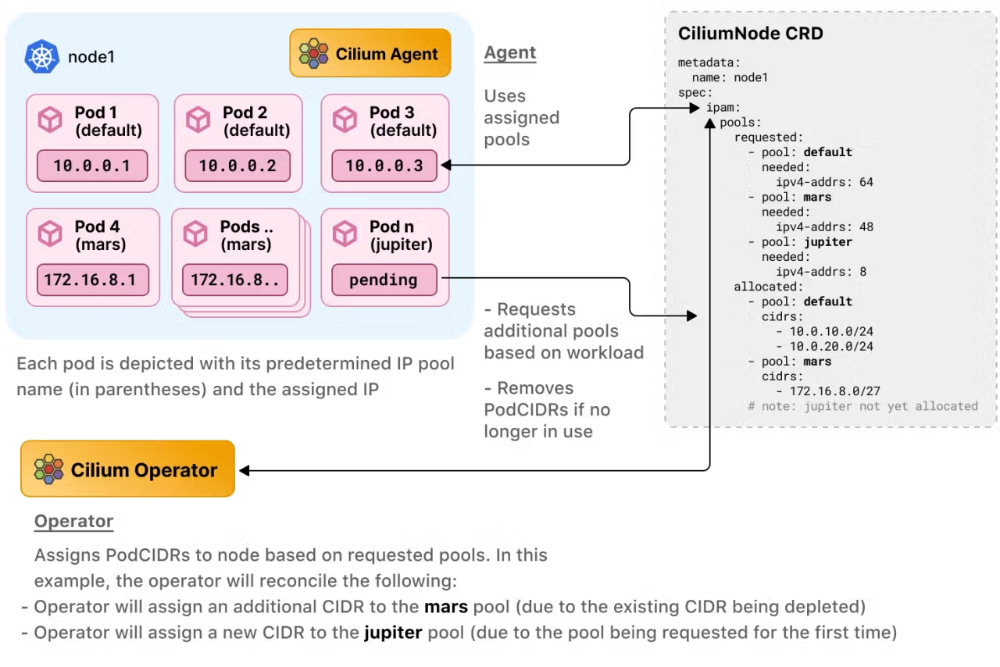</p>

- Pod IP Pool을 여러 개 생성한 다음 같은 노드에서 생성되는 Pod에게 서로 다른 IP Pool을 할당할 수 있다.

- `CiliumPodIPPool`을 생성해서 Pod IP Pool을 노드에 동적으로 추가할 수 있다.

##### Pod CIDR 선택 배포 테스트

- multi-pool ipam cidr 설정 파일을 생성한다.

  ```yaml
  # cilium-values.yaml
  ---
  ipam:
    mode: multi-pool
    operator:
      autoCreateCiliumPodIPPools:
        default:
          ipv4:
            cidrs: 172.20.0.0/16
            maskSize: 28
  ```

  ```bash
  helm install cilium cilium/cilium -n kube-system --version 1.17.5 -f cilium-values.yaml
  ```

- Cilium CLI를 이용해 multi pool ipam 배포 결과를 확인한다.

  ```bash
  $ cilium config view | grep multi-pool
  ipam                                              multi-pool
  $ cilium config view | grep auto-create
  auto-create-cilium-pod-ip-pools                   default=ipv4-cidrs:172.20.0.0/16;ipv4-mask-size:28
  ```

- 각 노드에 할당된 cidr 정보를 확인한다.

  ```bash
  $ for i in ctr w1 w2 ; do echo ">> node : cilium-$i <<"; kubectl get ciliumnodes cilium-$i -o yaml | yq .spec.ipam.pools.allocated ; echo; done
  >> node : cilium-ctr <<
  [
    {
      "cidrs": [
        "172.20.0.0/28",
        "172.20.0.16/28"
      ],
      "pool": "default"
    }
  ]

  >> node : cilium-w1 <<
  [
    {
      "cidrs": [
        "172.20.0.48/28",
        "172.20.0.80/28"
      ],
      "pool": "default"
    }
  ]

  >> node : cilium-w2 <<
  [
    {
      "cidrs": [
        "172.20.0.32/28",
        "172.20.0.64/28"
      ],
      "pool": "default"
    }
  ]
  ```

- 기존에 cilium cni를 설치하는 과정에 설정된 cidr 이후에도 ip 대역을 추가할 때는 `CiliumPodIPPool`을 사용할 수 있다.

- `CiliumPodIPPool`를 이용해 vac, no-engine에서 사용할 IP Pool을 추가한다.

  ```yaml
  # cilium_ip_pool_vac.yaml
  apiVersion: cilium.io/v2alpha1
  kind: CiliumPodIPPool
  metadata:
    name: vac
  spec:
    ipv4:
      cidrs:
        - 10.100.0.0/16
      maskSize: 29
  # cilium_ip_pool_no.yaml
  apiVersion: cilium.io/v2alpha1
  kind: CiliumPodIPPool
  metadata:
    name: no-engine
  spec:
    ipv4:
      cidrs:
        - 10.200.0.0/16
      maskSize: 29
  ```

  ```bash
  kubectl apply -f cilium_ip_pool_vac.yaml
  kubectl apply -f cilium_ip_pool_no.yaml
  ```

- `CiliumPodIPPool`를 생성할 때 `metadata.name` 필드를 이용해서 vac, no-engine를 만들었는데,

- Pod의 매니페스트 파일에서 annotation을 지정하지 않으면 default ip pool을 사용하게 된다.

- default ip pool 할당 여부를 확인하기 위해 기본 설정으로 deployment를 생성해보고 할당되는 IP 주소가 `172.20.0.0/16`인지 확인한다.

  ```bash
  $ kubectl create deployment netshoot --image nginx --replicas 2
  $ kubectl get po -owide
  NAME                        READY   STATUS    RESTARTS   AGE   IP            NODE        NOMINATED NODE   READINESS GATES
  netshoot-5fbc6f4997-2dd4z   1/1     Running   0          92s   172.20.0.77   cilium-w2   <none>           <none>
  netshoot-5fbc6f4997-4tmch   1/1     Running   0          92s   172.20.0.89   cilium-w1   <none>           <none>
  ```

- 특정 ip pool을 사용하고자 할 때는 `spec.template.metadata.annotation` 필드에 사용하고자 하는 ip pool의 name을 지정한다.

  ```yaml
  # deploy_vac.yaml
  apiVersion: apps/v1
  kind: Deployment
  metadata:
    name: nginx-vac
  spec:
    selector:
      matchLabels:
        app: nginx-vac
    replicas: 2
    template:
      metadata:
        labels:
          app: nginx-vac
        annotations:
          ipam.cilium.io/ip-pool: vac # ip pool name 지정
      spec:
        containers:
          - name: nginx
            image: nginx
            ports:
              - containerPort: 80
  ---
  # deploy_no.yaml
  apiVersion: apps/v1
  kind: Deployment
  metadata:
    name: nginx-no
  spec:
    selector:
      matchLabels:
        app: nginx-no
    replicas: 2
    template:
      metadata:
        labels:
          app: nginx-no
        annotations:
          ipam.cilium.io/ip-pool: no-engine # ip pool name 지정
      spec:
        containers:
          - name: nginx
            image: nginx
            ports:
              - containerPort: 80
  ```

- 배포 후 vac Pod는 `10.100.0.0/16`, no Pod는 `10.200.0.0/16` 대역의 주소가 의도한 대로 할당되었는지 확인한다.

  ```bash
  $ kubectl get pods -o wide
  NAME                         READY   STATUS    RESTARTS   AGE     IP            NODE        NOMINATED NODE   READINESS GATES
  netshoot-5fbc6f4997-2dd4z    1/1     Running   0          6m19s   172.20.0.77   cilium-w2   <none>           <none>
  netshoot-5fbc6f4997-4tmch    1/1     Running   0          6m19s   172.20.0.89   cilium-w1   <none>           <none>
  nginx-no-76df566dfb-4kfpx    1/1     Running   0          20s     10.200.0.11   cilium-w1   <none>           <none>
  nginx-no-76df566dfb-d6v2j    1/1     Running   0          20s     10.200.0.3    cilium-w2   <none>           <none>
  nginx-vac-65889dbdc9-75rr6   1/1     Running   0          82s     10.100.0.14   cilium-w2   <none>           <none>
  nginx-vac-65889dbdc9-dsp56   1/1     Running   0          82s     10.100.0.6    cilium-w1   <none>           <none>
  ```

##### CIDR 풀 자동 확장 테스트

- CIDR IP Pool이 확장 되기 전에 현재 노드 마다 할당된 CIDR IP Pool 정보를 확인한다.

  ```bash
  $ for i in ctr w1 w2 ; do echo ">> node : cilium-$i <<"; kubectl get ciliumnodes cilium-$i -o yaml | yq .spec.ipam.pools.allocated ; echo; done
  >> node : cilium-ctr <<
  [
    {
      "cidrs": [
        "172.20.0.0/28",
        "172.20.0.16/28"
      ],
      "pool": "default"
    }
  ]

  >> node : cilium-w1 <<
  [
    {
      "cidrs": [
        "172.20.0.48/28",
        "172.20.0.80/28"
      ],
      "pool": "default"
    },
    {
      "cidrs": [
        "10.200.0.8/29"
      ],
      "pool": "no-engine"
    },
    {
      "cidrs": [
        "10.100.0.0/29"
      ],
      "pool": "vac"
    }
  ]

  >> node : cilium-w2 <<
  [
    {
      "cidrs": [
        "172.20.0.32/28",
        "172.20.0.64/28"
      ],
      "pool": "default"
    },
    {
      "cidrs": [
        "10.200.0.0/29"
      ],
      "pool": "no-engine"
    },
    {
      "cidrs": [
        "10.100.0.8/29"
      ],
      "pool": "vac"
    }
  ]
  ```

- 추가된 ip pool은 `/29`로 8개씩 IP를 할당할 수 있는데 고갈된 경우 동적으로 확장되는지 테스트 하기 위해 `nginx-vac` deployment의 replicas 개수를 20개로 수정한다.

  ```bash
  $ kubectl scale deployment nginx-vac --replicas=20
  ```

- Pod의 배포 결과를 확인해 보면 기존 할당된 ip pool 대비 더 많은 Pod가 정상적으로 배포 된 것을 볼 수 있다.

  ```bash
  $ kubectl get po -owide
  NAME                         READY   STATUS    RESTARTS   AGE     IP            NODE        NOMINATED NODE   READINESS GATES
  netshoot-5fbc6f4997-2dd4z    1/1     Running   0          14m     172.20.0.77   cilium-w2   <none>           <none>
  netshoot-5fbc6f4997-4tmch    1/1     Running   0          14m     172.20.0.89   cilium-w1   <none>           <none>
  nginx-no-76df566dfb-4kfpx    1/1     Running   0          8m30s   10.200.0.11   cilium-w1   <none>           <none>
  nginx-no-76df566dfb-d6v2j    1/1     Running   0          8m30s   10.200.0.3    cilium-w2   <none>           <none>
  nginx-vac-65889dbdc9-2fz58   1/1     Running   0          39s     10.100.0.28   cilium-w2   <none>           <none>
  nginx-vac-65889dbdc9-4h48r   1/1     Running   0          6m51s   10.100.0.1    cilium-w1   <none>           <none>
  nginx-vac-65889dbdc9-75rr6   1/1     Running   0          9m32s   10.100.0.14   cilium-w2   <none>           <none>
  nginx-vac-65889dbdc9-7q2zr   1/1     Running   0          39s     10.100.0.30   cilium-w2   <none>           <none>
  nginx-vac-65889dbdc9-96bcx   1/1     Running   0          6m51s   10.100.0.13   cilium-w2   <none>           <none>
  nginx-vac-65889dbdc9-9jfcp   1/1     Running   0          6m51s   10.100.0.11   cilium-w2   <none>           <none>
  nginx-vac-65889dbdc9-bdj98   1/1     Running   0          39s     10.100.0.22   cilium-w1   <none>           <none>
  nginx-vac-65889dbdc9-bttzt   1/1     Running   0          39s     10.100.0.20   cilium-w1   <none>           <none>
  nginx-vac-65889dbdc9-chbhz   1/1     Running   0          6m51s   10.100.0.10   cilium-w2   <none>           <none>
  nginx-vac-65889dbdc9-ck4q8   1/1     Running   0          39s     10.100.0.27   cilium-w2   <none>           <none>
  nginx-vac-65889dbdc9-cqgmd   1/1     Running   0          6m51s   10.100.0.2    cilium-w1   <none>           <none>
  nginx-vac-65889dbdc9-dsp56   1/1     Running   0          9m32s   10.100.0.6    cilium-w1   <none>           <none>
  nginx-vac-65889dbdc9-jlchn   1/1     Running   0          39s     10.100.0.9    cilium-w2   <none>           <none>
  nginx-vac-65889dbdc9-l2nz5   1/1     Running   0          39s     10.100.0.29   cilium-w2   <none>           <none>
  nginx-vac-65889dbdc9-ncsmb   1/1     Running   0          39s     10.100.0.21   cilium-w1   <none>           <none>
  nginx-vac-65889dbdc9-nr7zv   1/1     Running   0          6m51s   10.100.0.3    cilium-w1   <none>           <none>
  nginx-vac-65889dbdc9-rggpj   1/1     Running   0          6m51s   10.100.0.12   cilium-w2   <none>           <none>
  nginx-vac-65889dbdc9-s9s6w   1/1     Running   0          39s     10.100.0.4    cilium-w1   <none>           <none>
  nginx-vac-65889dbdc9-vn4bv   1/1     Running   0          39s     10.100.0.17   cilium-w1   <none>           <none>
  nginx-vac-65889dbdc9-xsz9h   1/1     Running   0          6m51s   10.100.0.5    cilium-w1   <none>           <none>
  ```

- 필요한 IP 수가 늘어나게 되면 CIDR IP Pool이 자동으로 확장 된다.

  ```bash
  $ for i in ctr w1 w2 ; do echo ">> node : cilium-$i <<"; kubectl get ciliumnodes cilium-$i -o yaml | yq .spec.ipam.pools.allocated ; echo; done
  >> node : cilium-ctr <<
  [
    {
      "cidrs": [
        "172.20.0.0/28",
        "172.20.0.16/28"
      ],
      "pool": "default"
    }
  ]

  >> node : cilium-w1 <<
  [
    {
      "cidrs": [
        "172.20.0.48/28",
        "172.20.0.80/28"
      ],
      "pool": "default"
    },
    {
      "cidrs": [
        "10.200.0.8/29"
      ],
      "pool": "no-engine"
    },
    {
      "cidrs": [
        "10.100.0.0/29",
        "10.100.0.16/29"  # 추가된 cidr
      ],
      "pool": "vac"
    }
  ]

  >> node : cilium-w2 <<
  [
    {
      "cidrs": [
        "172.20.0.32/28",
        "172.20.0.64/28"
      ],
      "pool": "default"
    },
    {
      "cidrs": [
        "10.200.0.0/29"
      ],
      "pool": "no-engine"
    },
    {
      "cidrs": [
        "10.100.0.24/29",   # 추가된 cidr
        "10.100.0.8/29"
      ],
      "pool": "vac"
    }
  ]
  ```

<br>

#### 3.4 Load Balaner / Egress IPAM

<p align=center>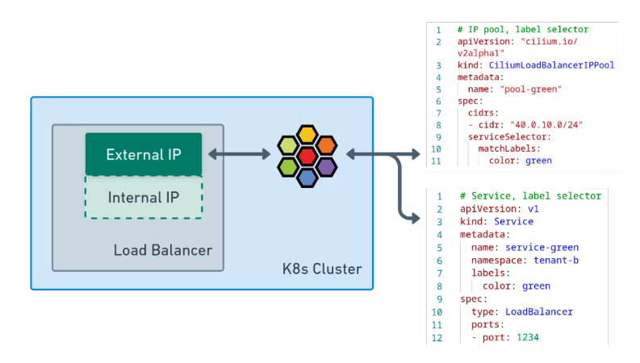</p>

- Cilium은 LoadBalancer/Ingress 유형의 Kubernetes 서비스에 클러스터 외부에 노출 할 External IP 주소를 직접 할당할 수 있다.

- 다른 CNI 같은 경우 Metal LB, AWS Load Balancer Controller와 같은 플러그인이 필요하지만 Cilium은 자체 기능을 통해 제공한다.

##### Load Balaner IP Pool 생성

- 쿠버네티스의 LoadBalancer, Ingress 리소스를 생성할 때 External IP에 할당할 IP Pool을 생성해야 한다.

  ```yaml
  # lb-ip-pool.yaml
  apiVersion: "cilium.io/v2alpha1"
  kind: CiliumLoadBalancerIPPool
  metadata:
    name: lb-ip-pool
  spec:
    cidrs:
      - cidr: "10.0.250.0/24"
  ```

- IP Pool 생성 후 Ingress Nginx 또는 ArgoCD와 같은 Ingress Controller, LoadBalancer Type의 리소스를 생성하면 자동으로 External IP가 할당된다.

  ```bash
  $ kubectl get svc -n ingress-nginx
  NAME                                 TYPE           CLUSTER-IP       EXTERNAL-IP   PORT(S)                      AGE
  ingress-nginx-controller             LoadBalancer   10.96.201.226    10.0.250.1    80:31181/TCP,443:32179/TCP   16d
  ```

- IP 주소가 할당되고 난 다음에는 외부 클라이언트가 해당 IP 주소로 접속할 수 있도록 네트워크 설정이 추가되어야 한다.

- BGP를 이용하는 방식(ToR 네트워크 장치 필요)과 ARP를 이용하는 L2 방식이 있다.

- ARP 를 통한 L2 방식을 사용하기 위해서는 Cilium CNI의 옵션을 추가해야 한다.

  ```yaml

  ---
  # cilium-values.yaml
  kubeProxyReplacement: true
  autoDirectNodeRoutes: true
  l2announcements:
    enabled: true
  externalIPs:
    enabled: true
  ```

  ```bash
  helm upgrade cilium cilium/cilium -n kube-system --version 1.17.5 -f cilium-values.yaml
  ```

- helm으로 Cilium을 재배포한 후 설정이 반영되었는지 확인한다.

  ```bash
  $ cilium config view | grep enable-l2
  enable-l2-announcements                           true
  enable-l2-neigh-discovery                         true
  ```

- 그 다음 LoadBalancer/Ingress에 할당되는 External IP에 대한 ARP 요청에 응답할 수 있도록 `CiliumL2AnnouncementPolicy`를 생성한다.

  ```yaml
  # cilium-l2-announcement-policy.yaml
  apiVersion: "cilium.io/v2alpha1"
  kind: CiliumL2AnnouncementPolicy
  metadata:
    name: cilium-l2-announcement-policy
  spec:
    externalIPs: true
    loadBalancerIPs: true
  ```

  ```bash
  kubectl apply -f cilium-l2-announcement-policy.yaml
  ```

- 배포 후 LoadBalancer/Ingress Type 서비스에 할당된 External IP로 요청을 보내면 응답을 받을 수 있다.

<br>
