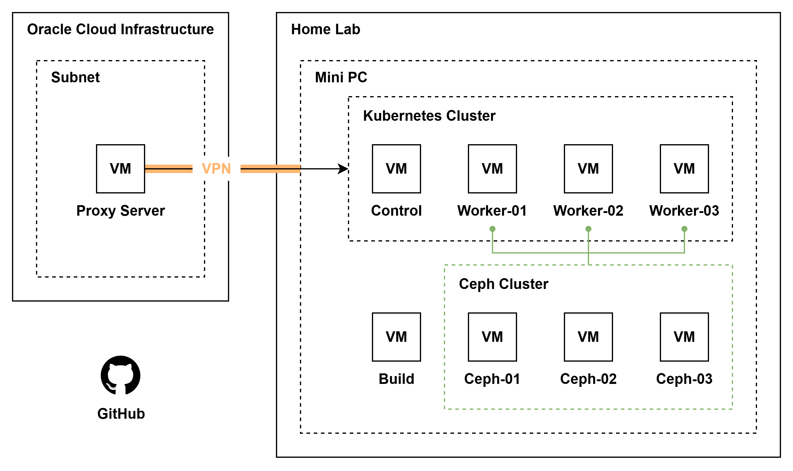

# Home Lab 인프라 구축

Cloud Native 기술 스택 검증을 위한 하이브리드 Home Lab 인프라 구축.
(Kubernetes 기반 컨테이너 오케스트레이션, 분산 스토리지, GitOps CI/CD Pipeline, 모니터링 스택을 포함)

## 아키텍처 개요

## 기술 스택

| 영역                | 기술                                                   |
| ------------------- | ------------------------------------------------------ |
| **Orchestration**   | Kubernetes · Docker · Cilium CNI · NetApp/Ceph/NFS CSI |
| **Virtualization**  | Vagrant · VirtualBox                                   |
| **Storage**         | Ceph Cluster(cephadm) · Ubuntu NAS Server              |
| **Network**         | OpenVPN                                                |
| **GitOps Pipeline** | ArgoCD · Jenkins                                       |
| **Registry**        | Nexus · GitHub                                         |
| **Observability**   | Prometheus · Grafana                                   |

## 프로젝트 구성

### [01. Infrastructure](./01-infrastructure/)
미니 PC 하드웨어 사양 및 Vagrant를 활용한 VM 프로비저닝 환경을 구성합니다.
- 하드웨어 스펙 및 네트워크 토폴로지
- Vagrant 기반 VM 자동 배포

### [02. Kubernetes](./02-kubernetes/)
고가용성 Kubernetes 클러스터를 구축하고 Cilium CNI를 적용합니다.
- kubeadm 기반 클러스터 설치
- Cilium eBPF CNI 구성
- 기본 매니페스트 템플릿

### [03. Storage](./03-storage/)
Ceph 분산 스토리지 클러스터와 CSI 드라이버를 구성합니다.
- cephadm을 활용한 Ceph 클러스터 배포
- NFS CSI / Ceph CSI 드라이버 설정
- StorageClass 및 PVC 관리

### [04. Networking](./04-networking/)
외부 접근 및 내부 트래픽 라우팅을 위한 네트워크 서비스를 구성합니다.
- Nginx Ingress Controller
- OpenVPN 서버 구축

### [05. CI/CD](./05-cicd/)
GitOps 기반 배포 파이프라인과 컨테이너 레지스트리를 구성합니다.
- ArgoCD를 활용한 GitOps 워크플로우
- Jenkins 빌드 파이프라인
- Private OCI Registry 운영

### [06. Observability](./06-observability/)
클러스터 및 애플리케이션 모니터링 환경을 구성합니다.
- Prometheus 메트릭 수집 및 알림
- Grafana 대시보드 구성